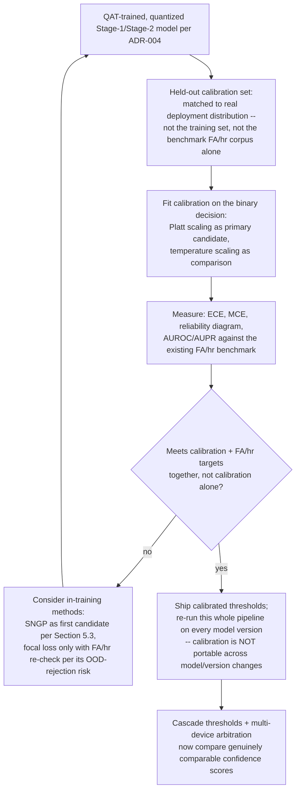

# AURA — Confidence Calibration Research Report
### Algorithms, Processes, and Recommended Pipeline

**Confidence labeling convention (unchanged from the rest of the AURA document set):** Verified / General Knowledge / Engineering Judgement / Needs Experimentation / Hypothesis.

---

## 1. Why calibration matters for AURA specifically — not just generically

Every prior AURA document has treated "confidence score" as a single opaque number the cascade thresholds against. Calibration is the study of whether that number actually means what it claims to mean. A model can have excellent accuracy and still be badly calibrated — e.g., outputting 0.95 "confidence" on predictions that are only right 80% of the time (overconfidence, the dominant failure mode in modern deep networks — **Verified**, this is the central empirical finding of Guo et al., "On Calibration of Modern Neural Networks," ICML 2017, the foundational paper in this area).

This isn't an abstract concern for AURA — it touches four things already committed to in your architecture:

1. **Cascade thresholds** (Stage-1 → Stage-2 → speaker verification). Your own training-techniques section already flagged temperature/Platt scaling as relevant for "setting principled, comparable thresholds across the cascade stages rather than ad hoc per-model thresholds" — this report is the follow-through on that flag.
2. **Multi-device arbitration.** This is the sharpest, most concrete reason calibration matters for AURA specifically: the arbitration design has each device broadcast its Stage-1 confidence, and the highest-confidence device wins. **If the models aren't calibrated consistently against each other, arbitration is broken by construction** — it will systematically favor whichever device's model is more overconfident, not whichever device actually heard the wake word most clearly. This is a correctness bug hiding in an already-designed feature, not a hypothetical.
3. **OTA rollout automatic rollback triggers.** The FA/hr and FRR field-metric thresholds that gate staged rollout assume the confidence score's meaning is stable across model versions. An uncalibrated model swap can shift the *operating point* implied by a fixed threshold even when underlying discrimination ability hasn't changed — a rollback trigger reading "regression" when the real story is "recalibration needed."
4. **Quantization (ADR-004: QAT by default).** Calibration and quantization interact in a specific, counter-intuitive way — covered in Section 6 below — that's directly relevant given AURA ships INT8.

## 2. A terminology collision worth flagging immediately

**"Calibration" means two unrelated things in this stack, and they will get confused in team conversation if not named explicitly:**

- **Confidence/probability calibration** (this report's subject): does a model's output score reflect true correctness likelihood?
- **Quantization (PTQ) calibration**: the unrelated process of feeding a small "calibration dataset" through a model to determine activation clipping ranges/scale factors for INT8 conversion — **Verified**, standard PTQ terminology (e.g., TensorRT's `IInt8EntropyCalibrator`).

Recommend the team explicitly say "confidence calibration" vs. "quantization calibration" in docs/code from here on — reusing "the calibration set" ambiguously across both meanings is a realistic source of miscommunication given AURA's INT8 requirement already puts "calibration" in the room for the second reason.

## 3. How calibration is measured

| Metric | What it captures | Notes |
|---|---|---|
| **Expected Calibration Error (ECE)** | Bins predictions by confidence (typically 10 bins), computes the weighted average gap between confidence and actual accuracy per bin | The standard metric in the literature (**Verified** — used across every paper cited below). Formula: bin predictions by `max f(x)`, compute `Σ (\|B_i\|/n) · \|accuracy(B_i) − confidence(B_i)\|` |
| **Maximum Calibration Error (MCE)** | Worst-case bin gap, not average | More relevant than ECE when a single badly-miscalibrated confidence region (e.g., "always slightly overconfident right at your trigger threshold") matters more than the average — arguably the more relevant metric for AURA's *threshold-region* behavior specifically, since that's the only region the cascade actually acts on |
| **Reliability diagrams** | Visual: accuracy vs. confidence per bin, ideally the identity line | The standard diagnostic plot — **Verified**, used in every paper below |
| **Brier score** | Mean squared error between predicted probability and the binary outcome | A "proper scoring rule" — rewards both calibration and sharpness (discrimination) jointly, unlike ECE which only measures calibration |
| **Negative Log-Likelihood (NLL)** | Standard cross-entropy on held-out data | Sensitive to calibration but conflates it with raw accuracy — useful as a secondary check, not primary |
| **AUROC / AUPR for OOD/negative rejection** | For KWS specifically: separability between "wake word" and "everything else" scores | Directly maps onto FA/hr — a well-calibrated *and* well-separated model is what you actually want; calibration alone doesn't guarantee good separation (Section 5's SNGP-vs-focal-loss comparison shows these can trade off against each other) |

## 4. Post-hoc calibration methods (applied after training, on a held-out set)

### 4.1 Temperature Scaling — the default, cheapest option
**Verified**, Guo et al. 2017. Divide the logits by a single learned scalar `T > 0` before softmax:
```
p_calibrated = softmax(z / T)
```
`T` is fit by minimizing NLL on a held-out validation set — a single scalar, fit in seconds, **does not change the model's argmax predictions or accuracy at all**, only reshapes confidence magnitudes. This is the correct first thing to try for AURA's Stage-1/Stage-2 models: cheap, well-understood, doesn't touch the shipped model weights, doesn't require retraining.

**Known limitation** (directly relevant to AURA): temperature scaling is a single global scalar — it can't fix calibration that varies by *condition* (e.g., the model is well-calibrated on clean audio but overconfident specifically on noisy/far-field audio). Two recent papers address exactly this:
- **Attended Temperature Scaling** (Mozafari et al., arXiv:1810.11586) — shows plain TS breaks down with small/noisy calibration sets, proposes an attention-weighted variant. **Verified paper exists**, relevant if your calibration set is small per device/condition segment.
- **Quantile-Adaptive Temperature Scaling** (2026, arXiv:2606.21749) — addresses TS's blind spot that miscalibration is often concentrated in specific confidence quantiles rather than uniform. **Verified paper exists** (very recent — worth reading directly rather than relying on this summary alone before adopting).

### 4.2 Platt Scaling
**Verified**, Platt 1999 — the historical predecessor to temperature scaling; fits a 2-parameter logistic regression (`a·z + b`) rather than TS's single scalar. More flexible than TS, still cheap, but the extra parameter can overfit on a small calibration set — for AURA's binary wake/no-wake decision specifically (not a multi-class problem), Platt scaling is actually a more natural fit than temperature scaling, which was designed for multi-class softmax. **Engineering Judgement: for the binary Stage-1/Stage-2 trigger decision specifically, Platt scaling may be the more appropriate default over temperature scaling — worth A/B-ing both, not assuming TS is automatically correct just because it's more popular in the general literature (which is dominated by multi-class image classification).**

### 4.3 Isotonic Regression
**Verified**, Zadrozny & Elkan 2002. Non-parametric — fits an arbitrary monotonic step function mapping raw score → calibrated probability. More flexible than Platt/TS (can fix non-sigmoid-shaped miscalibration), but needs more calibration data to avoid overfitting since it has many more effective parameters. **Engineering Judgement: worth trying if Platt/TS's calibration curve, plotted as a reliability diagram, shows a shape isotonic regression could fix and TS/Platt can't — don't reach for it first.**

### 4.4 Histogram Binning
**Verified**, Zadrozny & Elkan 2001 — the simplest non-parametric method (bin predictions, replace each bin's output with its empirical accuracy). Generally dominated by isotonic regression in the literature (isotonic regression can be seen as an adaptive-bin-width generalization) — include for completeness, not as a recommendation over 4.3.

### 4.5 Dirichlet Calibration / Beyond-Temperature-Scaling methods
**Verified**, Kull et al. 2019 ("Beyond Temperature Scaling") — generalizes temperature scaling to a full matrix transform for genuinely multi-class problems. **Lower priority for AURA** — this matters most for problems with many classes where per-class miscalibration patterns differ; AURA's core decision is binary/few-class (wake word vs. not, or a handful of concurrent wake words), where the simpler methods above are more appropriate first.

### 4.6 Neural Clamping
**Verified**, Tang, Chen, Ho (arXiv:2209.11604) — combines temperature scaling with a small learned input perturbation, claims to provably dominate temperature scaling alone. **Engineering Judgement: interesting but adds a learned input-space transform ahead of the model — evaluate only after the simpler methods (4.1–4.4) have been tried and shown insufficient; added complexity should be earned, not assumed.**

## 5. In-training calibration techniques (change how the model is trained, not just post-processed)

### 5.1 Label Smoothing
**Verified**, Müller, Kornblith, Hinton, "When Does Label Smoothing Help?" NeurIPS 2019. Soften one-hot targets: `y_smooth = (1−λ)·y + λ/K`, typically `λ ∈ [0.01, 0.1]`. Already named in your own training-techniques discussion as a standard, cheap regularizer — this report adds that its *calibration* benefit specifically (not just its regularization benefit) is well-documented, but the paper also shows label smoothing can *hurt* calibration when combined with certain post-hoc methods afterward (see 5.4's negative-interaction note) — don't stack it blindly with temperature scaling without checking both together.

### 5.2 Focal Loss
**Verified**, Mukhoti et al., "Calibrating Deep Neural Networks using Focal Loss," NeurIPS 2020 — already named in your training-techniques section as a class-imbalance technique; this paper's actual contribution is showing it *also* improves calibration, because it implicitly regularizes prediction entropy (minimizes a KL-divergence term while increasing predictive entropy, preventing overconfidence) rather than only reweighting hard/easy examples. Requires tuning `γ` (they also propose an automatic per-sample `γ` selection method).

**Important nuance found in the audio-classifier-specific study (Section 5.3 below): focal loss's calibration benefit can come at a real cost to out-of-distribution rejection ability** — directly relevant to AURA's FA/hr concern, not just an academic caveat.

### 5.3 Uncertainty-estimation methods, benchmarked specifically on audio classifiers
**Verified** — Ye, Si, Wang, Cheng, Xiao, "Uncertainty Calibration for Deep Audio Classifiers" (arXiv:2206.13071) is the most directly relevant paper found: an empirical comparison of MC Dropout, Deep Ensembles, Focal Loss, and SNGP (Spectral-normalized Neural Gaussian Process) specifically on audio classification (ESC-50, GTZAN), across three CNN backbones. Their own reported results (not independently re-verified by this report, presented as the authors' findings):

| Method | Calibration (ECE) | OOD rejection (AUROC) | Compute cost |
|---|---|---|---|
| Uncalibrated baseline | Worst (e.g., 0.106–0.195 ECE across settings) | Baseline | Lowest |
| Focal loss | Improves ECE substantially | **Degrades OOD rejection** — the paper explicitly flags this as a real trade-off, worst performer on AUROC in two of three backbones tested | Low (near-baseline) |
| MC Dropout | Moderate improvement | Slight improvement | Higher (multiple forward passes) |
| Deep Ensemble (M=5) | Moderate improvement | Best after SNGP | Highest (~5x params/inference cost) |
| SNGP | **Best on both ECE and OOD rejection**, across all three backbones tested | **Best** | Near-baseline (efficient) |

**Why this matters for AURA specifically:** your FA/hr metric is fundamentally an out-of-distribution/negative-rejection problem (is this audio the wake word or not), not a pure in-distribution accuracy problem — this paper's finding that **focal loss improves calibration but can hurt OOD rejection** is a direct, concrete warning against adopting focal loss for calibration reasons alone without re-measuring FA/hr, not just ECE. SNGP's combination of good calibration *and* good OOD rejection, at near-baseline compute cost, makes it the standout candidate worth prototyping — but note this paper's datasets (ESC-50 general environmental sounds, GTZAN music genres) are not KWS-specific, so this is **Engineering Judgement transferring a finding from adjacent audio-classification research, not a KWS-verified result** — flag as Needs Experimentation on AURA's own cascade before committing.

### 5.4 Known interaction risk across all in-training methods
**Verified**, multiple sources converge on this: combining in-training calibration techniques (label smoothing, focal loss) with post-hoc calibration (temperature scaling) afterward can produce **"negative calibration"** — the combination calibrates worse than either alone. Cited independently by the "Where are we with calibration under dataset shift" survey (arXiv:2507.07780) referencing Wang et al. 2021 and Zhang et al. **Practical implication for AURA: if you adopt an in-training method (focal loss/label smoothing), re-measure ECE with and without an additional post-hoc temperature-scaling pass — don't assume stacking them is strictly better.**

## 6. Quantization × calibration interaction (directly relevant given ADR-004: QAT by default)

**Verified**, "An Underexplored Dilemma between Confidence and Calibration in Quantized Neural Networks" (arXiv:2111.08163) — the core finding, stated precisely: post-training quantization acts like injected noise on activations/logits; a prediction only flips if the noise is large enough to change the top logit. **Overconfident predictions are therefore more robust to being flipped by quantization noise than well-calibrated (less confident) ones** — meaning a model deliberately made *less* confident/better-calibrated can, counter-intuitively, become *more* fragile to accuracy loss under post-training quantization specifically.

**This is a genuinely important, non-obvious finding for AURA's own architecture decisions:**
- It's a real tension with Section 4/5's calibration recommendations — pursuing better calibration (lower confidence on borderline cases) could make Stage-1/Stage-2 slightly more sensitive to PTQ-induced accuracy loss specifically.
- It does **not** argue against ADR-004's QAT-by-default decision — if anything it strengthens the case for QAT over PTQ, since QAT lets the model learn to be robust to quantization noise *during* training rather than being calibrated first and quantized (and destabilized) after. **Recommend: if you calibrate via temperature/Platt scaling, do so on the already-quantized (QAT-trained) model's outputs, not on the pre-quantization float model** — calibrating before quantizing risks calibrating a version of the model that no longer exists once QAT/quantization is applied.
- Sequencing recommendation (**Engineering Judgement, Needs Experimentation to confirm on AURA's own models**): train (with QAT) → quantize → *then* fit temperature/Platt scaling on the final INT8 model's actual output distribution on held-out data. Calibration should be the last step in the pipeline, not an earlier one.

## 7. Recommended calibration pipeline for AURA



**Key process rules, stated explicitly because they're easy to skip under schedule pressure:**

1. **Calibration must be re-fit per model version, not carried over.** A recalibrated `T`/Platt parameters from Stage-1 v1.2.0 do not transfer to v1.3.0 even if the architecture is unchanged — this should be a required step in the model-promotion checklist (extends the existing benchmark-harness requirement already established for FA/hr/latency), not an optional afterthought.
2. **The calibration set must not be the same set used for FA/hr benchmarking**, or you'll overfit your calibration to your own benchmark corpus and get a falsely rosy ECE that doesn't hold in the field — use a genuinely separate held-out split.
3. **Multi-device arbitration specifically needs cross-device calibration consistency checked**, not just per-device calibration quality — two individually well-calibrated models trained/calibrated independently can still disagree systematically if their calibration sets differed in composition (e.g., different accent/noise mix). This is a new, AURA-specific validation step not covered by the general calibration literature, which mostly considers a single model in isolation.
4. **Add ECE/MCE/reliability-diagram generation to the existing benchmark harness** (the one already producing FA/hr, DET curves, latency) as an additional standard output per model version — this makes calibration a routinely-tracked metric like everything else already in that pipeline, not a one-off analysis someone has to remember to run.

## 8. Recommended new ADR

**ADR-Calibration** (new): *Confidence calibration method and process for cascade/arbitration thresholds.*
- **Status:** Proposed — Needs Experimentation before Accepted.
- **Candidates to prototype, in this order:** (1) Platt scaling as the cheap default given AURA's binary decision structure, (2) temperature scaling as a comparison point given it's the field's most common baseline, (3) SNGP as a training-time candidate if post-hoc methods prove insufficient, given its favorable joint calibration+OOD-rejection result in the one directly-relevant audio-classifier study found (Section 5.3) — explicitly **not** recommending focal-loss-for-calibration as a first choice, given its documented OOD-rejection cost in that same study.
- **Sequencing dependency:** must be fit *after* QAT/quantization (Section 6), not before.
- **New validation requirement:** cross-device calibration-consistency check for multi-device arbitration (Section 7, rule 3) — this doesn't exist anywhere in the current benchmark harness spec and should be added.
- **Owner:** ML/Runtime Architect, per the existing ownership matrix.

## 9. Summary of confidence levels in this report

Directly verified against primary sources during this research pass: Guo et al. 2017 (temperature scaling), Platt 1999, Zadrozny & Elkan 2001/2002, Müller et al. 2019 (label smoothing), Mukhoti et al. 2020 (focal loss), Ye et al. 2022 (audio-classifier-specific empirical comparison), the quantization-confidence interaction paper (arXiv:2111.08163), and the two 2026-dated temperature-scaling extensions. Everything marked Engineering Judgement or Needs Experimentation is explicitly flagged as such above and should not be treated as settled without AURA's own measurement — consistent with the discipline established across the rest of this document set.
