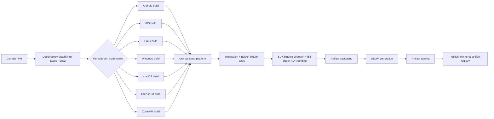
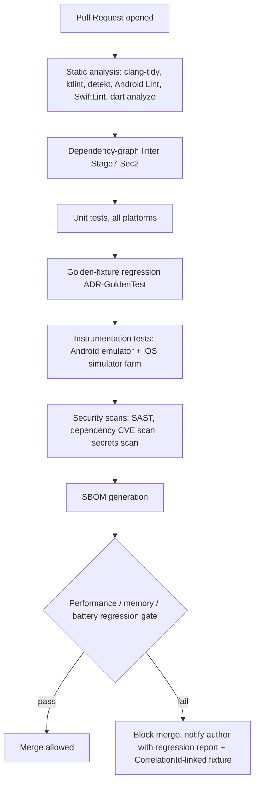
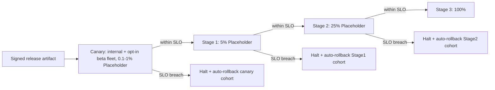
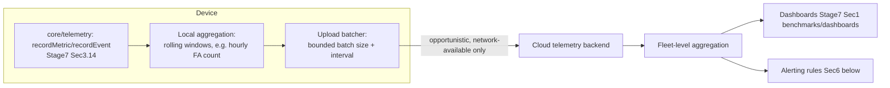

# PROJECT AURA — Stage 8
## Production Readiness & Operations Blueprint

This document assumes Stages 1-7 are final. Every reference below to an ADR ID points at the Stage 7 SAS Section 19 register and is not re-derived. This document is operational, not architectural -- it describes how a built AURA system is shipped, monitored, debugged, and recovered, not how it is designed internally.

**Note on numeric planning values throughout this document:** where a specific number appears (SLO threshold, capacity estimate, retention period), it is labeled either **[Placeholder -- requires real fleet/measurement data]** or **[Policy -- team-set, adjust freely]**. None are measured facts; this document does not fabricate benchmarks, consistent with every prior stage.

---

## 1. Build System

**Gradle structure** (Android `sdk/kotlin` + `apps/android`, per Stage 7 Sec1/Sec15):
```
sdk/kotlin/
├── aura-core-bindings/     # Generated JNI bindings (ADR-Binding) -- build.gradle invokes the CMake build
│                           #   for core/ as an externalNativeBuild task, not a separate manual step
├── aura-sdk/               # Idiomatic Kotlin wrapper over the generated bindings (hand-written)
└── build.gradle.kts        # Root -- declares the CMake build as a dependency task of :aura-core-bindings:build
apps/android/
└── build.gradle.kts        # Depends on :aura-sdk; this is the reference app, not the SDK release artifact
```
Gradle's `externalNativeBuild { cmake { ... } }` block points at the same CMake root established in Stage 7 Sec15 -- there is no second, Gradle-specific native build definition to keep in sync.

**Soong integration:** relevant only if AURA is ever integrated as a preloaded/system-level Android component (as opposed to an app-distributed SDK) -- Soong (AOSP's Blueprint-based build system) would require an `Android.bp` module wrapping the same CMake-built `core/` static library. **This is not built in Stage 8** -- it is scoped here as a known, bounded future integration path (a shim around the existing CMake artifact, not a build-system migration) should an OEM/system-integration deal require it.

**Bazel compatibility:** some enterprise consumers of the SDK may run Bazel internally and need to ingest `core/` as a Bazel target rather than a prebuilt binary. Delivered via a generated `BUILD.bazel` file (using `rules_foreign_cc`'s `cmake` rule to wrap the existing CMake build) published alongside each release artifact -- a compatibility shim for consumers, not a change to AURA's own primary build system (CMake remains authoritative per ADR-Build).

**CI build graph:**


**Artifact generation:** per-platform `core/` binaries, per-language SDK packages (Kotlin AAR, Swift Package, Dart plugin, Python wheel -- per Stage 7 Sec15), and signed firmware images.

**OTA package generation:** built from the same artifact-packaging step above, specialized per the OTA design (`aura_addendum_v4.md` Sec6): a manifest (version, checksum, signature) plus either a **full model image** or a **delta package** (binary diff against the previous shipped version) -- delta preferred when the previous version is known to be already installed, full image used for first-install or when the delta would exceed a size threshold **[Policy -- e.g., delta abandoned if >70% of full-image size]**.

**Release channels:** `alpha` -> `dogfood` -> `beta` -> `stable` -> `lts`, detailed in Section 14; each channel maps to a distinct signing-key scope (not a shared key across channels) so a compromised alpha-channel key cannot forge a stable-channel package -- this extends ADR-Provisioning's trust-anchor model with per-channel sub-keys under the same root of trust.

**Signing:** every artifact (model file, OTA manifest, SDK package, firmware image) is signed independently at the point it's produced in the CI pipeline, per the model-signing/manifest-signing distinction already established in `aura_addendum_v4.md` Sec6.

**Reproducible / hermetic builds:** CI runs all platform builds inside pinned, hash-locked container images (or an equivalent pinned toolchain manifest for platforms without container support, e.g., iOS/Xcode); combined with the vendored/pinned `third_party/` dependencies (Stage 7 Sec15), this makes a bit-identical-output claim verifiable per platform -- verified by a rebuild-and-diff CI check on a sampled fraction of runs **[Policy -- sampling rate team-set]**, not asserted as unconditionally true.

**Cache strategy:** shared object-file cache (ccache-equivalent) keyed by toolchain-hash + source-hash, scoped per platform target; cache invalidation is toolchain-version-triggered (a toolchain pin bump invalidates that platform's cache namespace entirely, avoiding stale-cache correctness bugs at the cost of one full rebuild per toolchain bump).

---

## 2. CI/CD

**PR validation pipeline:**


**Static analysis specifics:**
- `clang-tidy` plus the Stage 7 Sec16 coding-standard checks (RTTI/exception/shared_ptr-usage linting) for all `core/` C++.
- `ktlint` (formatting) + `detekt` (static-analysis rules) + Android Lint for `sdk/kotlin`/`apps/android`.
- The Stage 7 Sec2 dependency-graph linter and Sec16 module-header-summary linter both run here, not as a separate manual review step.

**Emulator farm:** Android emulator matrix (API-level x ABI combinations covering the platform-tiering ADR's Tier-1/2 Android versions) plus iOS Simulator matrix; used for instrumentation tests that need a full OS but not physical audio hardware (audio input is injected via `tests/mock_platform/` in emulated runs -- emulator audio hardware is not trusted as representative and is never used for latency/accuracy claims, only for functional/API-surface correctness).

**Performance / memory / battery regression gates:**

| Gate | Metric source (Stage 7 Sec13) | Regression threshold | Action on failure |
|---|---|---|---|
| Latency | `wake.latency.e2e` | >X% increase **[Placeholder]** | Block merge |
| Memory | `memory.rss.high_water_mark` | >X% increase **[Placeholder]** | Block merge |
| Battery | `power.draw.estimated` (or duty-cycle proxy) | >X% increase **[Placeholder]** | Block merge, requires hardware-in-loop run |

Battery-gate specifics: because power measurement requires physical hardware-in-loop (Stage 7 Sec14), the battery regression gate runs on the **nightly** hardware-matrix lane, not per-PR; a PR that would regress battery is caught within 24 hours, not blocked at merge time -- an explicit, accepted trade-off between CI turnaround and hardware-farm capacity, not an oversight.

**Benchmark module:** `benchmarks/harness/` (Stage 7 Sec1) is a CI-invokable module with a stable CLI (`aura-bench run --suite=fa_hr|latency|power --target=<platform>`), used identically by CI and by a developer running it locally.

**Security scans:** SAST on `core/` and all SDK code; dependency CVE scanning against `third_party/`'s pinned versions; secrets-scanning on every commit.

**SBOM generation:** per Stage 6 Sec5, generated as a CI step producing a machine-readable SBOM per released artifact, attached to the artifact registry entry.

**Release automation:** a release is a tagged commit that has passed every gate above on every Tier-1 platform (minimum) plus the nightly hardware-in-loop suite at least once since the tag; automation promotes already-built-and-tested artifacts (build-once-promote-many), avoiding an "it built differently at release time" class of bug.

---

## 3. OTA Infrastructure

**Delta updates:** binary-diff against the previously-installed version where known; falls back to full-image delivery when the delta ratio exceeds policy, the previous version is unknown (first install), or the target device reports insufficient scratch storage to apply a delta.

**A/B partitions:** for platforms/hardware that support it (embedded/Cortex-M/ESP32 tier, and any Android system-level integration per Section 1's Soong note) -- the device holds two model-image slots; an update writes to the inactive slot, and the boot/activation sequence (Stage 7 Sec7.4/Sec8.7) only marks the new slot primary after `SelfTesting` passes. This is the hardware/partition-level realization of the same stage-verify-activate-self-test-commit-or-rollback state machine already specified in Stage 7 -- A/B partitioning is the storage mechanism, not a new state machine.

**Rollback protection:** the previous slot/model version is never erased until the new version has been `Committed` (Stage 7 Sec7.4) for a policy-defined bake period **[Policy -- e.g., 24-72 hours of successful operation]**, not merely until the self-test passes at install time -- protects against failures that only manifest after sustained real-world use.

**Staged rollout / canary / production rollout:**

Percentages and dwell-time-per-stage are **[Placeholder -- team/product policy]**; the mechanism (each stage gated on the failure-metrics table below, auto-halt on breach) is the fixed part of this design.

**Version pinning:** a device/fleet-segment can be pinned to a specific version -- a `Config`-level override (Stage 7 Sec9) that suppresses `ota/`'s automatic-update-eligibility check for that device without disabling OTA entirely.

**Rollback triggers (automatic):**

| Trigger | Threshold | Source |
|---|---|---|
| Self-test failure at install | Single failure | Stage 7 Sec7.4 `SelfTesting` |
| Crash-rate spike post-update | >X% increase vs. pre-update baseline, within bake period **[Placeholder]** | Crash reporting (Sec4/Sec6) |
| FA/hr or FRR field-metric spike | >X% degradation vs. pre-update baseline **[Placeholder]** | `fa_rate`/`fr_rate` telemetry (Stage 7 Sec13) |
| Battery-drain field-metric spike | >X% increase vs. pre-update baseline **[Placeholder]** | `power.draw.estimated` field telemetry |
| Manual halt | Operator-triggered | Release engineering (Sec14) |

**Failure metrics** feeding the triggers above are computed per rollout cohort (canary/stage1/stage2), not fleet-wide, so a regression is caught and rolled back within the affected cohort before wider exposure -- the direct operational payoff of staged rollout.

---

## 4. Telemetry

**Metrics pipeline:**


**Local aggregation:** raw per-event telemetry (Stage 7 Sec3.14's bounded ring buffer) is aggregated on-device into rolling-window summaries (e.g., "FA count in the last hour," "mean wake latency in the last hour") before upload — the upload batcher (below) transmits summaries, not raw per-event streams, both to bound bandwidth (Section 13) and to keep the privacy posture at "aggregate only," consistent with the offline-first/privacy-first positioning established from Stage 1 onward.

**Upload batching:** batched on a `Config`-controlled interval **[Policy, e.g., every 4-6 hours or on WiFi-connect]**, opportunistic (never triggers a cellular-data or battery-wake event solely to upload telemetry — rides on other network activity, e.g., an OTA check, where possible) and always subject to the offline-fallback guarantee (`aura_addendum_v4.md` Sec6): a device that never uploads telemetry continues to function fully.

**Privacy-preserving analytics:** aggregation is combined with a minimum-cohort-size threshold before any fleet-level metric is surfaced on a dashboard (e.g., a metric segment with fewer than N devices **[Policy]** is suppressed rather than displayed, to avoid re-identification risk in small segments) — this is the concrete mechanism satisfying the DPDP/GDPR/CCPA-aware telemetry design flagged as legally significant in prior documents (ADR-Legal-DPDP), pending the still-outstanding formal legal review of the exact threshold/method.

**Crash reporting:** native (C++) crashes captured via a per-platform crash handler (e.g., signal handler on POSIX-like targets, structured exception handling on Windows, `NDK`-level crash capture on Android) writing a minidump to local storage tagged with the `CorrelationId` active at crash time (Stage 7 Sec12) where one exists; uploaded via the same batcher above (crash reports are higher-priority than routine metrics and may trigger an off-cycle upload attempt on next network availability, but never a forced wake for upload).

**ANR reporting (Android-specific):** Android's Application-Not-Responding detection (main-thread blocked beyond the OS threshold) is monitored for `apps/android`'s reference app and any consuming app's use of `sdk/kotlin`; because AURA's Stage 7 threading model keeps SDK-facing callbacks off the Audio/Inference threads (Section 6 of Stage 7), an ANR involving AURA specifically most likely indicates a violation of the "no synchronous re-entry into `core/` mutating APIs from a listener callback" rule (Stage 7 Section 4/6) — ANR reports are automatically checked against this known failure signature before general triage.

**DSP metrics, wake-word latency, model inference metrics:** all originate exactly as specified in Stage 7 Section 13 (`wake.latency.e2e`, `wake.latency.stage1/2`, `cache.model_mmap.page_faults`, etc.) — Stage 8 adds only the pipeline (above) that gets them off-device, not new metric definitions.

**Battery metrics:** `power.draw.estimated` (Stage 7 Sec13) aggregated fleet-wide as a distribution (not just a mean — a battery-drain regression often affects a tail of devices/conditions, e.g., a specific SoC or a specific ambient-noise environment causing more Stage-1 wake-ups, and a mean can hide this).

---

## 5. Logging

**Structured logs:** as specified in Stage 7 Section 12 — every log line is a structured record, never a free-text string, at the point of emission.

**Binary logs:** on-device persistent logs are stored in a compact binary encoding (not JSON/text) to minimize flash wear and storage footprint (directly relevant to the MCU flash-wear concern already flagged — logs are one more source of repeated flash writes alongside OTA updates, and both should share the same wear-leveling-aware storage subsystem, not separate ad hoc write paths).

**Persistent logs:** retained on-device in a ring-buffer-style bounded log file (oldest entries overwritten first) sized per platform tier **[Policy — e.g., 1-5MB on mobile, far smaller on MCU]**; persistent logs survive a process restart (unlike in-memory-only `Trace`-level logs, Stage 7 Sec12) specifically so a crash or OTA rollback event has log history to attach to its report.

**Log rotation:** rotated on the bounded-file-size policy above, not on a fixed time interval — ensures a burst of `Warn`/`Error` activity (which is exactly when logs matter most for debugging) doesn't get rotated away prematurely by a time-based policy while normal operation logs sit unrotated.

**Crash snapshots:** at crash time, the last N seconds of `Debug`-level (not just `Warn`/`Error`) log history is flushed into the crash report bundle (§11 below) even if `Debug` logging was otherwise being sampled/suppressed in the running build (Stage 7 Sec12) — a one-time exception to the sampling policy specifically for the crash-adjacent window, since this is exactly the data most useful for root-causing the crash and is otherwise unrecoverable after the fact.

**Privacy filtering / redaction:** enforced at the type level already (Stage 7 Sec12 — no log/telemetry record type can hold raw PCM or raw embeddings); Stage 8 adds a redaction pass specifically for free-text `message` fields (e.g., a file path containing a username on desktop platforms) applied before any log leaves the device, using a pattern-based redactor (home-directory paths, email-like patterns) as a defense-in-depth measure on top of the type-level guarantee, not a replacement for it.

**Upload policy:** persistent logs are uploaded only (a) attached to an explicit crash/ANR report, (b) attached to a user-initiated diagnostics bundle (§11 below), or (c) never in the routine telemetry batch (§4) — routine telemetry is metrics/events, not raw log text, keeping the two upload paths and their privacy review scopes distinct.

---

## 6. Observability

**Tracing / spans:** the `CorrelationId`-based cascade tracing already specified (Stage 7 Sec12, ADR-Tracing) is the on-device equivalent of a trace; each pipeline stage transition (VadTriggered → Stage1Running → ... ) is emitted as a span-like structured log/telemetry entry sharing the CorrelationId, which is sufficient to reconstruct a per-cascade "trace" without adopting a full distributed-tracing library on-device (unnecessary overhead for a single-process, mostly-single-device system).

**Distributed tracing across services:** applies specifically to the **cloud-side** components (OTA backend, telemetry backend, remote-config service, and the multi-device-arbitration coordination path if a cloud-assisted fallback is ever added — Stage 6/7 established local-only arbitration as the default, so this is a smaller surface than a typical cloud-native trace scope) — standard OpenTelemetry-style trace/span propagation across these backend services, with the device-side `CorrelationId` (where an operation spans device and cloud, e.g., an OTA check) threaded into the cloud trace as a linked, not parent-child, span, since the device is not always connected and cannot participate in a live distributed trace.

**Perfetto integration (Android):** `apps/android` and `sdk/kotlin` emit Perfetto-compatible trace events (via the Android `Trace` API, which Perfetto captures) around the JNI boundary calls into `core/`, so an app engineer debugging a slow `sdk/kotlin` call can see, in a standard Android system trace, whether time was spent in the Kotlin wrapper, the JNI crossing, or inside `core/` itself.

**Systrace:** superseded by Perfetto on current Android tooling; retained only as a fallback capture method for older Android versions still within the Tier-2/3 platform-support window (per the platform-tiering ADR) where Perfetto's on-device tracing daemon isn't available.

**Custom counters:** the Stage 7 Section 13 metrics (`queue.ring_buffer.depth`, etc.) are additionally exposed as live Perfetto/Android `TraceCounter`-style counters (not only as batched telemetry) specifically so a developer can watch them in real time during local debugging, distinct from their fleet-telemetry role.

**Flame graphs:** generated from CPU-profiling captures (§9 below) for the Inference thread specifically — the thread the Stage 7 Section 6 threading model identifies as having the highest, most variable latency contribution, making it the highest-value profiling target.

**Debugging hooks:** `core/` exposes a compile-time-gated (`AURA_ENABLE_DEBUG_LOCK_INSTRUMENTATION`, Stage 7 Sec9, plus a new `AURA_ENABLE_DEBUG_HOOKS` flag) internal introspection API (current pipeline state per Stage 7 Section 7's state machines, current ring-buffer depths, current active model versions per slot) consumed by the internal diagnostics UI (Section 11 below) — never compiled into release builds.

---

## 7. Security Operations

**Key rotation:** per-channel signing sub-keys (Section 1) are rotated on a fixed schedule **[Policy — e.g., annually, or immediately on suspected compromise]**; rotation is additive (a new key is added to the trusted-key set before the old one is removed) so in-flight artifacts signed with the outgoing key remain verifiable through their staged-rollout bake period (Section 3) — never a hard cutover that could strand an in-progress rollout.

**Certificate management:** any TLS certificates used by the OTA/telemetry backend endpoints (Section 4) follow standard automated renewal (e.g., ACME-based) well ahead of expiry, with device-side certificate pinning (Stage 6 Sec8) updated via the same OTA/remote-config channel as any other configuration — a pinned-cert update is itself subject to the staged-rollout mechanism (Section 3) to avoid a bad pin update bricking connectivity fleet-wide at once.

**Secure boot verification:** on platforms with a hardware secure-boot chain (ESP32-S3's Secure Boot, and any Android system-integration path's Verified Boot, per Section 1's Soong note), AURA's firmware/model images are chained into that verification rather than implementing a parallel, redundant check — `core/security/`'s own model-signature verification (Stage 7 Sec3.5) is a defense-in-depth layer on top of, not a substitute for, the platform's own secure/verified boot.

**Verified Boot interaction (Android):** if AURA ships as a preloaded system component, its partition/image is included in Android Verified Boot's (AVB) hash tree, meaning a tampered AURA system image would fail device boot entirely, not just fail an app-level check — this is a stronger guarantee than anything achievable at the app-distributed-SDK integration tier, and is explicitly a benefit that only applies to the Section 1 Soong-integration path, not the default SDK-distribution path.

**SELinux auditing (Android system-integration path only):** if AURA runs as a system service (per the Runtime Health service list, Section 8 below), its SELinux domain/policy is defined with least-privilege access (e.g., access to the audio HAL and its own storage partition, no access to unrelated app data) and SELinux denial logs (`avc: denied` entries) are monitored as a security-operations signal — an unexpected denial pattern post-update can indicate either a packaging bug or an attempted privilege escalation, and both warrant investigation.

**Privilege escalation detection:** for the app-distributed-SDK integration tier (the default, non-system path), this reduces to standard mobile-app sandboxing guarantees already provided by the OS — AURA does not request or need elevated privileges beyond microphone access and (if used) local-network access for discovery (Stage 7 Sec3.17); a build requesting any broader permission than this is a release-blocking review flag, not a runtime-monitored condition.

**Supply-chain security / dependency verification / binary provenance:** per the SBOM generation already scoped (Section 2), each `third_party/` dependency's SBOM entry is checked against a known-vulnerability database on every release (not just at initial vendoring) — a newly-disclosed CVE in an already-vendored, unchanged dependency triggers a release-engineering review (Section 14) even without any AURA-side code change, since the vulnerability now exists in the field regardless.

**Artifact signing:** covered in Section 1; Section 7 adds that the signing keys themselves are the specific asset covered by the key-rotation policy above and by hardware-backed storage (Secure Enclave/Keystore/HSM depending on where the signing operation is performed — CI-side signing uses an HSM-backed key, not a developer-machine key, per standard release-engineering practice).

---

## 8. Runtime Health

**Health-monitored services (relevant specifically to the Section 1 Soong/system-integration deployment tier, where AURA's components run as discrete system services rather than one linked-in SDK):**

| Service | Health signal | Watchdog action on failure |
|---|---|---|
| Launcher (if AURA ships with a companion launcher/UI surface) | Process liveness, main-thread responsiveness | Restart; if repeated within a window, fall back to a minimal-UI safe mode |
| Wake-word engine (`core/` via `IWakeWordEngine`) | Heartbeat from the Audio thread (a periodic "still processing frames" signal, distinct from the audio data itself) | Restart the engine instance; if repeated, transition to the Stage 7 Sec7.5 `SafeMode` for detection specifically |
| DSP service | Per-stage processing-time bound (a DSP stage taking pathologically long is itself a health signal, not just a latency metric) | Restart the audio pipeline (Stage 7 Sec3.6's pause/resume mechanism, not a full engine restart) |
| Speech/model service (`runtime/`) | `IInferenceBackend::stats()` reporting inference times exceeding a bound, or repeated `Result` errors | Trigger the rollback path (Stage 7 Sec7.2/8.7), since a persistently failing model is the scenario that state machine already exists to handle |
| Model service (`model/`) | mmap/handle consistency check (the generation-counter mechanism, Stage 7 Sec5, doubles as a health check — a stuck generation counter indicates the Inference thread has stopped consuming) | Escalate to Error Recovery (Stage 7 Sec7.5) |
| Overlay manager (if a system-level UI overlay exists, e.g., a wake indicator) | Standard Android service-liveness check | Restart |
| Notification service (if present, for surfacing OTA/error status to the user) | Standard Android service-liveness check | Restart |

**Watchdog recovery, general pattern:** every watchdog above escalates through the same three tiers before giving up: (1) restart the specific failing component in place, (2) if the failure recurs within a bounded window, restart a broader containing scope (e.g., the whole engine, not just one thread), (3) if that also recurs, enter the appropriate `SafeMode`/degraded state already defined in Stage 7 Section 7.5 rather than looping restarts indefinitely (a crash-loop is worse for the user than a clearly-surfaced degraded state).

---

## 9. Memory & Performance Operations

**Continuous profiling:** low-overhead sampling profilers run continuously on a small opt-in cohort in production (not the full fleet — profiling overhead, even "low overhead," is not zero) to catch performance regressions that only manifest at fleet scale/diversity beyond what the pre-release benchmark hardware matrix (Stage 7 Sec14) covers.

**Memory leak detection:** in CI, via the debug-build allocation-tracking instrumentation (Stage 7 Sec5) run across the 7-day soak lane (Stage 7 Sec14); in production, via the `memory.rss` trend (Stage 7 Sec13) — a monotonically increasing RSS trend over a device's uptime, not explained by an expected cause (e.g., an in-progress model hot-swap's transient double-residency, Stage 7 Sec5), is flagged for investigation.

**Heap dump policy:** heap dumps are large and privacy-sensitive (may contain in-memory copies of otherwise-protected data) — captured only in internal/dogfood-channel builds (Section 14) on an engineer-triggered basis via the diagnostics tooling (Section 11), never automatically uploaded from a production/stable-channel device.

**Native crash analysis:** minidumps (Section 4) are symbolicated server-side against the debug-symbol artifacts produced (but not shipped) by the same CI build that produced the crashing release (Section 1/2) — symbol-artifact retention per release is a capacity-planning line item (Section 13).

**CPU profiling / GPU profiling:** CPU profiling per Section 6's flame-graph pipeline; GPU profiling is relevant only where an inference backend uses GPU/NPU delegation (e.g., CoreML on ANE, TensorRT on Jetson per the runtime ADRs) and uses each platform's native GPU-profiling tool (Xcode GPU frame capture, Nsight for Jetson) rather than a custom AURA-built GPU profiler.

**Startup profiling:** directly instruments the Cold/Warm Startup sequences (Stage 7 Sec8.1/8.2), attributing the `model.load_time.cold/.warm` metric (Stage 7 Sec13) to specific sub-phases (platform init, config resolution, per-model-slot load) so a startup-time regression can be attributed to the specific phase that regressed, not just "startup got slower."

**Battery profiling:** platform-native battery-profiling tools (Android Battery Historian equivalent/current tooling, Xcode Energy Log) used during pre-release hardware-in-loop testing (Stage 7 Sec14); production battery metrics (Section 4) are the fleet-scale complement to this lab-scale tooling, analogous to the lab-vs-field FA/hr distinction already established in Stage 7 Sec13.

---

## 10. Feature Flags

**Local flags:** compiled-in defaults plus any on-device developer/debug override (Stage 7 Sec9) — unchanged from Stage 7, restated here only for completeness of the operations picture.

**Remote flags:** delivered via the same `Config`-resolution precedence chain already specified (Stage 7 Sec9: remote > local override > compiled default) — Stage 8 adds the operational delivery mechanism: remote flags ride the same staged-rollout infrastructure as OTA model updates (Section 3), since a bad remote-config change is exactly as capable of degrading the fleet as a bad model, and deserves the same canary-first treatment, not a separate, less-guarded config-push path.

**Kill switches:** a specific, high-priority category of remote flag capable of disabling an entire feature (e.g., speaker verification, per its existing ADR-005 gate; or the multi-device-arbitration feature) fleet-wide within one config-propagation cycle, bypassing the normal staged-rollout percentage ramp (a kill switch is inherently an emergency, all-at-once action, not a gradual rollout) — reserved for genuine incidents (Section 15 playbooks), not routine feature management.

**Experiment framework:** A/B-style cohort assignment reuses the same aggregation/cohort-size-threshold privacy mechanism already specified for telemetry (Section 4) — an experiment cohort is itself a telemetry segment and inherits the same minimum-cohort-size-before-reporting rule.

**Config versioning:** every resolved `Config` snapshot (Stage 7 Sec3.2) carries a version identifier; telemetry (Section 4) tags metrics with the active config version alongside the existing `{platform, buildVersion, modelVersion}` tags (Stage 7 Sec13), so a metric regression can be correlated against a config change independently of a build/model change.

**Rollback (of a flag/config change):** identical mechanism to the OTA rollback triggers (Section 3) — a config-change-correlated regression triggers an automatic revert to the previous `Config` version, not just a manual one.

---

## 11. Production Debugging

**adb tools (Android):** a custom `adb shell dumpsys aura` -style diagnostic command (for the system-integration tier) or an app-exposed debug intent (for the SDK-distribution tier) surfacing current engine state (Stage 7 Section 7 state machines), current metrics snapshot, and current active model versions per slot — built directly on the `AURA_ENABLE_DEBUG_HOOKS` introspection API (Section 6).

**Developer mode:** a `Config`-gated mode (Stage 7 Sec9, local-override precedence) unlocking verbose logging (`Trace` level, unsampled, per Stage 7 Sec12), the internal diagnostics UI (below), and disabling production upload-batching delays (for faster iteration during development) — never reachable via remote config (a remote attacker/compromised backend must not be able to remotely flip a fleet device into developer mode).

**Internal diagnostics UI:** a debug-build-only in-app surface showing live values from the debug-hooks API (Section 6) — pipeline state, ring-buffer depths, per-stage confidence scores for the most recent detection cascade (keyed by its `CorrelationId`), current power state (Stage 7 Sec7.7).

**Trace capture:** on-demand Perfetto trace capture (Section 6), triggerable from the diagnostics UI or the adb tooling above, bundled into the diagnostics bundle (below).

**Log extraction:** pulls the current persistent log file (Section 5) via the same adb/diagnostics-UI mechanism.

**Bug report generation / one-click diagnostics bundle:** a single action bundling: recent persistent logs (Section 5), the most recent N `CorrelationId`-tagged detection cascades' full trace (Section 6), current `Config` snapshot and version (Section 10), current metrics snapshot (Section 4), and (if `Config`'s developer mode is active) a fresh trace capture — packaged as a single shareable archive, explicitly excluding raw audio and raw embeddings by construction (same type-level guarantee as Section 5's logging privacy filter, not a manual redaction step at bundle-creation time).

---

## 12. Disaster Recovery

**Failed OTA recovery:** handled by the existing Stage 7 Section 7.4/8.7 rollback state machine — Stage 8 adds only the operational trigger conditions (Section 3's rollback-triggers table) and the bake-period policy (Section 3) around it; no new recovery mechanism is introduced here.

**Corrupted model recovery:** if a model fails its signature/checksum check at load time (Stage 7 Section 7.2 `Rejected` state) and no previous known-good `Active` model exists for that slot (e.g., corruption discovered on very first boot), the engine enters the per-subsystem `SafeMode` for detection (Stage 7 Sec7.5) while remaining reachable for a fresh OTA fetch attempt — this is the specific scenario the Stage 7 ADR register flagged as the one case needing a fallback beyond simple rollback, and the answer is "detection-disabled but OTA-reachable," not a bricked device.

**Database/config-store recovery:** any persisted local state beyond model files/logs (e.g., the enrolled-speaker-template store, Stage 7 Sec3.12, or the local peer-discovery table, Sec3.17) is treated as reconstructible/re-enrollable rather than requiring backup-and-restore machinery — speaker enrollment is a user-repeatable action, and the peer-discovery table is ephemeral by design (rebuilt via mDNS/BLE re-discovery on next startup, Stage 7 Sec8.8) — this is a deliberate scope decision to avoid building a general-purpose on-device database-recovery subsystem for state that doesn't warrant one.

**Configuration recovery:** a corrupt/unparseable locally-persisted `Config` override falls back to the compiled-in default (Stage 7 Sec9's precedence chain, read in reverse on a parse failure) rather than failing engine startup — configuration corruption must never be a startup-blocking condition given the always-on product requirement.

**Rollback policy:** consolidated summary — model rollback (Section 3), config rollback (Section 10), and OTA-package rollback (Section 3) all share the same underlying "stage before activate, keep the previous version until bake period completes" pattern (Stage 7 Section 5), rather than three independently-designed rollback mechanisms — this consistency is a deliberate simplification, not a coincidence.

**Safe mode:** per-subsystem (Stage 7 Sec7.5), not a single global safe mode — restated here because disaster-recovery playbooks (Section 15) need to reference the specific subsystem's safe mode, not a monolithic concept.

**Factory reset strategy:** clears all local state (enrolled speaker templates, persisted config overrides, persistent logs, discovery peer table) and returns the device to the `Unprovisioned` state (Stage 7 Sec7.6) — explicitly does **not** clear the hardware-backed trust anchor on platforms where that trust anchor is provisioned at manufacturing time and is not meant to be user-resettable (re-provisioning after factory reset uses the existing anchor, not a fresh manufacturing-time provisioning flow, except on platforms/business-rules where a full re-provisioning is the intended factory-reset behavior — this distinction is a product policy decision **[Policy — not resolved by this document]**, flagged rather than assumed).

---

## 13. Capacity Planning

All figures below are **[Placeholder — replace with real fleet-size/usage assumptions once available]**, structured as a planning template, not a forecast.

| Resource | Estimation basis | Placeholder assumption | Notes |
|---|---|---|---|
| Telemetry bandwidth | (fleet size) x (aggregated-summary size per upload interval) | e.g., ~1-5 KB per device per upload cycle, cycle per Section 4's policy | Aggregated summaries, not raw events, per Section 4 — this keeps the multiplier small regardless of fleet size, by design |
| Storage growth (backend) | telemetry + crash reports + SBOM/artifact history, retained per a data-retention policy | Retention period **[Policy, e.g., 90 days raw, longer for aggregated rollups]** | Retention period itself is a DPDP/GDPR-relevant decision (ADR-Legal-DPDP), not purely a capacity decision |
| Log storage (on-device) | bounded ring-buffer file size (Section 5) x fleet size, only relevant to backend capacity when logs are uploaded (crash/diagnostics only, Section 5) | Most log storage cost is on-device, not backend — backend cost is bounded by crash/ANR rate x bundle size, not fleet size x continuous log volume | |
| Cache usage (build/CI) | object-file cache (Section 1) sized to the working set of active branches | **[Placeholder — depends on CI provider/team size]** | |
| Memory budgets (on-device) | already specified per-platform-tier in Stages 1-7 (e.g., <20MB mobile target) | Not re-derived here — this row exists only to note that capacity planning for the *fleet* (this section) is distinct from the *per-device* budget (Stage 1-7), and both must be tracked | |
| CPU budgets (on-device) | already specified per-platform-tier (<5% CPU mobile target) | Same note as above | |
| Inference budgets (cloud, if any cloud-assisted inference path is ever added) | **Not applicable to the current architecture** — all inference is on-device per every prior stage's "fully offline" requirement; this row is included only to explicitly confirm there is no cloud-inference capacity line item to plan for, rather than silently omitting it | | |

---

## 14. Release Engineering

| Channel | Audience | Update cadence | Rollout mechanism | Purpose |
|---|---|---|---|---|
| Alpha | Internal engineering only | Continuous (every merged main-branch build, or near it) | Direct install, no staged rollout | Fastest-possible feedback loop; expected to be unstable |
| Dogfood | Internal company-wide, opt-in | Daily/weekly **[Policy]** | Direct install to the dogfood cohort, still no percentage-staged rollout (the whole cohort is already a bounded, consenting group) | Broader internal exposure before external users see a build |
| Beta | External opt-in users | Weekly/biweekly **[Policy]** | Staged rollout (Section 3) within the beta cohort itself | First external signal, still recoverable at small scale |
| Stable | General availability | Per the release cadence below | Full staged rollout (Section 3), canary through 100% | Primary production channel |
| LTS (Long-Term Support) | Customers requiring extended support windows (e.g., regulated/enterprise deployments, version-pinned per Section 3) | Security/critical-fix backports only, no routine feature updates | Same staged-rollout mechanism, applied to a pinned base version | Stability guarantee distinct from the rolling Stable channel |
| Hotfix | Any channel, out-of-band | As needed, triggered by an active incident (Section 15) | Expedited staged rollout — may compress or skip early canary stages for a critical security fix specifically, per an explicit, documented incident-response exception process, not as routine practice | Rapid remediation without waiting for the next scheduled release |

**Semantic versioning:** `MAJOR.MINOR.PATCH` at both the SDK/binary level and the model-artifact level (Stage 7 Section 9's model-versioning scheme) — a `MAJOR` bump signals an incompatible interface/contract change (Stage 7 Sec9), `MINOR`/`PATCH` signal backward-compatible improvements/fixes.

**Release cadence:** Stable channel cadence is **[Policy — not fixed by this document]**; the mechanism (staged rollout gated on failure-metric SLOs, Section 3) is what determines how *safely* a release ships, and is independent of how *often* one ships — a faster cadence does not require relaxing any gate defined in Sections 2/3.

---

## 15. Operations Playbooks

Each playbook: Symptoms / Diagnostics / Recovery / Rollback / Postmortem checklist.

### 15.1 Wake-word failure (elevated FRR or total non-response)
- **Symptoms:** `fa_rate`/`fr_rate` telemetry (Stage 7 Sec13) shows FRR spike; or zero `DetectionEvent`s fleet-wide/cohort-wide over a window that should statistically include some.
- **Diagnostics:** check `wake.latency.stage1/2` for silent failures (a stage timing out rather than rejecting cleanly); check Stage 7 Sec7.3 cascade state distribution (are cascades stuck in `VadTriggered` without reaching `Stage1Running`?); pull a sample of affected devices' diagnostics bundles (Section 11).
- **Recovery:** if isolated to a specific model version, initiate rollback (Section 3); if isolated to a specific config version, initiate config rollback (Section 10); if neither, escalate to Stage 7 Sec7.5 Error Recovery investigation.
- **Rollback:** per Section 3/10 mechanisms — no new mechanism needed for this playbook.
- **Postmortem checklist:** was this caught by a CI gate (Section 2) and missed, or was it a genuinely field-only condition (e.g., a device/locale/accent combination outside the pre-release benchmark corpus, Stage 6 Sec6's volume-parity gap)? If the latter, feed the specific failing audio pattern back into the golden-fixture corpus (Stage 7 Sec14) as a new regression test, closing the loop.

### 15.2 OTA failure
- **Symptoms:** elevated `ota.rollback_count` (Stage 7 Sec13); devices stuck in `Staged` or `RollingBack` (Stage 7 Sec7.4) beyond expected duration.
- **Diagnostics:** check signature/checksum verification failure rate specifically (a spike here suggests a CI/signing pipeline bug, Section 1/7, not a device-side issue) versus self-test failure rate (suggests the model/config itself is bad, not the delivery pipeline).
- **Recovery:** halt the affected rollout stage (Section 3) immediately; if signing/pipeline-side, treat as a Section 7 supply-chain incident, not merely an OTA incident.
- **Rollback:** automatic per Section 3's triggers; verify the rollback itself completes (a rollback that also fails is the corrupted-model-recovery scenario, Section 12).
- **Postmortem checklist:** confirm the bake-period (Section 3) was sufficient to have caught this before wider rollout, or adjust it if not.

### 15.3 Model corruption
- **Symptoms:** signature/checksum failures at load (Stage 7 Sec7.2 `Rejected`); or a loaded model producing systematically anomalous confidence-score distributions (a distinct signal from corruption caught by checksum — this is "loads fine, behaves wrong").
- **Diagnostics:** compare the affected model artifact's checksum against the CI-recorded canonical checksum from the artifact registry (Section 1); if they match, the corruption is in-transit/on-device (storage-media issue) rather than a build artifact; if they don't match, investigate the CI/signing pipeline.
- **Recovery:** Section 12's corrupted-model-recovery path.
- **Rollback:** N/A if no prior good model exists (falls to SafeMode per Section 12); otherwise standard model rollback (Section 3).
- **Postmortem checklist:** was this a single-device storage fault (no fleet-wide action needed beyond the individual device's own recovery) or a systemic artifact/pipeline problem (requires halting all in-flight rollouts of that version immediately)?

### 15.4 High battery drain
- **Symptoms:** `power.draw.estimated` fleet distribution's tail (Section 4) shifts unfavorably.
- **Diagnostics:** correlate against `queue.ring_buffer.depth`/drop counts (Stage 7 Sec13 — a struggling pipeline retrying/dropping more may draw more power than a healthy one), against Stage 7 Sec7.7 power-state distribution (are devices failing to reach `LowPower`/`DeepSleep` as expected?), and against recent config/model changes (Section 10's config-version tagging).
- **Recovery:** if traced to a specific change, rollback (Section 3/10); if traced to a specific device/SoC segment, consider a targeted `Config` override (e.g., a more conservative VAD sensitivity for that segment) rather than a fleet-wide change.
- **Rollback:** as above.
- **Postmortem checklist:** was the pre-release hardware-in-loop battery benchmark (Stage 7 Sec14) run on hardware representative of the affected segment? If not, this is a hardware-matrix coverage gap to close, not just a one-off incident.

### 15.5 ANR spike (Android)
- **Symptoms:** ANR rate (Section 4) increase, specifically implicating AURA SDK call stacks.
- **Diagnostics:** check first for the known failure signature (synchronous re-entry into `core/` from a listener callback, Section 4) before general investigation, since this is the most probable cause given the Stage 7 threading contract.
- **Recovery:** if the known signature, this is a consuming-app integration bug, not an AURA engine bug — provide the app team the specific offending call stack and the Stage 7 Section 4/6 contract documentation; if not the known signature, escalate as a genuine `core/` threading bug.
- **Rollback:** SDK version rollback for the consuming app (outside AURA's own release channels, but AURA's release notes/migration guide should flag any threading-contract-relevant change prominently, per Stage 7 Sec16's documentation requirement).
- **Postmortem checklist:** if it was the known signature repeatedly, consider whether the SDK API itself (Stage 7 Section 4) can be hardened to make the violation impossible (e.g., detecting synchronous re-entry at runtime in debug builds and failing loudly) rather than only documenting the contract.

### 15.6 Crash spike
- **Symptoms:** crash-rate telemetry (Section 4) exceeds baseline.
- **Diagnostics:** symbolicated stack traces (Section 9) clustered by root cause; cross-reference against recent OTA/config rollout stages (Section 3/10) for correlation.
- **Recovery:** rollback the correlated change (Section 3/10) if found; otherwise treat as a standalone defect requiring a hotfix release (Section 14).
- **Rollback:** as above.
- **Postmortem checklist:** was this crash signature present in the pre-release fuzz/stress lanes (Stage 7 Sec14) and missed, or genuinely novel? Add a regression fixture/fuzz seed corresponding to the root cause either way.

### 15.7 Backend outage (OTA/telemetry/remote-config backend unavailable)
- **Symptoms:** upload-batcher (Section 4) and OTA-check (Section 3) failures fleet-wide, not device-specific.
- **Diagnostics:** standard backend-service health checks (outside AURA's on-device scope — this is conventional cloud-service incident response) plus confirmation that the offline-fallback guarantee (`aura_addendum_v4.md` Sec6) is holding — i.e., devices continue full detection functionality throughout the outage, which is the specific architectural investment this incident validates or invalidates.
- **Recovery:** standard backend incident response; on-device, no recovery action is needed if the offline-fallback guarantee holds as designed — this playbook's most important diagnostic question is confirming that it does.
- **Rollback:** N/A (backend-side incident, not a device-artifact rollback).
- **Postmortem checklist:** did any device exhibit degraded *detection* behavior (not just degraded telemetry/OTA availability) during the outage? If yes, this indicates the "OTA/telemetry failures never affect core detection" isolation guarantee (Stage 7 Section 2's dependency-graph rows, Section 11 graceful-degradation principle) was violated somewhere and needs root-causing as a Row-boundary violation, not merely a backend incident.

### 15.8 Telemetry outage (telemetry backend specifically, OTA/remote-config unaffected)
- **Symptoms:** telemetry upload failures without corresponding OTA/config-check failures.
- **Diagnostics:** confirm devices are correctly buffering (not dropping beyond the designed bounded-buffer-with-drop-counter behavior, Stage 7 Sec3.14) rather than erroring.
- **Recovery:** standard backend incident response; on-device, the bounded-ring-buffer-with-drop-counter design (Stage 7 Sec3.14) is explicitly meant to absorb exactly this scenario gracefully.
- **Rollback:** N/A.
- **Postmortem checklist:** once the backend recovers, confirm the drop-counter metric (Stage 7 Sec13) accurately reflects the data lost during the outage window, so downstream fleet-metric dashboards (Section 4) can correctly annotate that window as having reduced-confidence data rather than silently presenting it as a real (e.g., artificially low FA count) signal.

---

*End of Stage 8 — Production Readiness & Operations Blueprint. Together with Stages 1-7, this constitutes the complete PROJECT AURA specification as of this review. Items marked [Policy] and [Placeholder] throughout are the explicit, enumerated set of decisions and data points still required from the team/legal/business stakeholders before full operational readiness — this document does not resolve them itself, consistent with every prior stage's discipline on distinguishing engineering specification from business/legal decision-making.*
