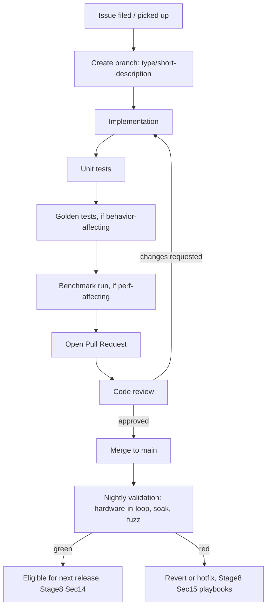
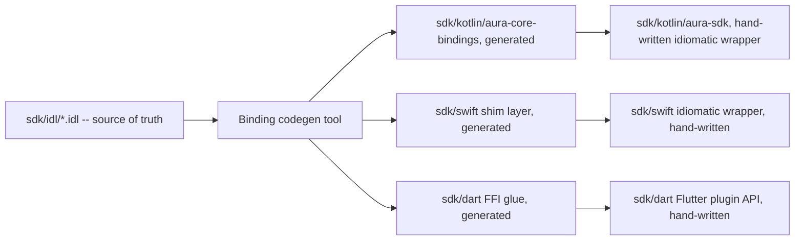

# PROJECT AURA — Stage 9
## Engineering Execution & Developer Handbook

This is a handbook, not an architecture document. Every design decision referenced below was made in Stages 1-8 and is not reopened here. Where a numeric threshold appears, it is tagged **[Placeholder — requires measurement]** or **[Policy — engineering/team decision]**, consistent with every prior stage.

---

# 1. Developer Onboarding

**Repository clone:**
```bash
git clone <aura-repo-url> aura && cd aura
git submodule update --init --recursive   # pulls third_party/ pinned dependencies (Stage7 Sec15)
```

**Directory walkthrough (5-minute orientation, full detail in Stage 7 Section 1):**
```
core/       -> if you're changing detection/DSP/runtime behavior, you're here
sdk/        -> if you're changing a language binding, you're here
apps/       -> reference apps; not where product logic lives
benchmarks/ -> if you're touching model/DSP code, you WILL need this
tests/      -> golden fixtures, fuzz, stress, mock_platform
tools/      -> codegen, release scripts, CI scripts
docs/       -> Stages 1-9, generated API docs, ADR register
```

**Toolchain installation (by platform you intend to build):**

| Target | Required tools |
|---|---|
| Core (`core/`, any platform) | CMake >= [Policy — pin version in `tools/versions.txt`], Ninja, a C++20-capable compiler (clang or MSVC per platform) |
| Android | Android Studio (bundled NDK version pinned in `tools/versions.txt`), JDK per Gradle's requirement |
| iOS/macOS | Xcode (version pinned in `tools/versions.txt`), command-line tools |
| Windows | Visual Studio (Desktop C++ workload), or clang-cl if using the Ninja generator |
| Linux/Raspberry Pi | gcc or clang, ALSA/PipeWire dev headers per the audio-API ADR (Stage 6 Finding, Section 8 below) |
| ESP32-S3 | ESP-IDF (version pinned in `tools/versions.txt`) |
| Cortex-M | Arm GNU Toolchain, or the vendor SDK for your specific board (Zephyr/FreeRTOS per ADR) |
| Tooling/scripts | Python 3.x (version pinned), used only for `tools/` and `benchmarks/harness/`, never for `core/` itself |

**Git hooks:** `tools/install-hooks.sh` installs a pre-commit hook running formatting (clang-format, ktlint) and the dependency-graph linter (Stage 7 Section 2) locally, before CI ever sees the commit — this catches the cheapest-to-fix class of CI failure before push.

**First successful build:**
```bash
cmake --preset host-debug            # presets defined in CMakePresets.json, one per platform + debug/release
cmake --build --preset host-debug
```
"host" here means "build `core/` for your current development machine" (Linux/macOS/Windows desktop) — this is the fastest inner-loop build and should be your default while iterating on platform-independent `core/` code; cross-compiled platform builds (Section 8) are slower and should not be your primary edit-compile-test loop.

**Running first tests:**
```bash
ctest --preset host-debug --output-on-failure
```

**Running first benchmark (against `tests/mock_platform/`, no real hardware needed):**
```bash
./benchmarks/harness/aura-bench run --suite=latency --target=host-mock
```

**Verifying environment:**
```bash
./tools/doctor.sh   # checks toolchain versions against tools/versions.txt, flags mismatches
```

**Common setup mistakes:**
- Forgetting `--recursive` on clone, leading to an empty `third_party/` and confusing link errors — always the first thing to check when a fresh clone fails to build.
- Building with a system-installed CMake older than the pinned minimum — `tools/doctor.sh` catches this; a manual `cmake --version` check is the fallback.
- Attempting a cross-compiled platform build (Section 8) as your first build — start with `host-debug` per above.
- Editing generated SDK binding code directly (`sdk/kotlin/aura-core-bindings/`, etc.) instead of the IDL source (`sdk/idl/`) — regenerated on next build and your edit is silently lost; this is the single most common new-contributor mistake for anyone touching the SDK layer.

---

# 2. Repository Development Workflow



**Branch naming:** `<type>/<short-description>`, where `<type>` is one of `feat`, `fix`, `perf`, `refactor`, `docs`, `test`, `chore` — mirrors the commit-message convention below so a branch name and its eventual squash-merge commit message stay consistent.

**Commit message convention (Conventional Commits style):**
```
<type>(<module>): <short summary>

<body — why, not just what>

Refs: #<issue>
```
Example: `fix(audio): correct backpressure drop-oldest boundary condition at pool capacity`. The `<module>` scope should match a `core/` module name (Stage 7 Section 3) or an `sdk/`/`apps/` path where relevant — this makes `git log --grep`/changelog generation (Section 14) usable by module.

**Pull Request checklist (enforced by a PR template, not just convention):**
- [ ] Linked issue or RFC (Section 10) referenced
- [ ] Unit tests added/updated
- [ ] Golden-fixture test added if detection/DSP behavior changed (Section 5)
- [ ] Benchmark run attached if the change touches Audio/Inference-thread code (Section 11) — a PR touching `core/audio/`, `core/dsp/`, `core/features/`, `core/vad/`, `core/runtime/`, or `core/detect/` without a benchmark run is blocked from merge, not merely discouraged
- [ ] Documentation updated (module header per Stage 7 Section 16, or `docs/` if user-facing)
- [ ] No new `TODO` without a linked follow-up issue
- [ ] Dependency-graph linter passes (Stage 7 Section 2) — automatic CI check, listed here so reviewers know not to manually re-verify it
- [ ] If touching an `I*` interface (Stage 7 Section 4): SDK binding regeneration diff reviewed (Section 9 below), not just the C++ change

**Definition of Done (engineering-workflow level; Stage 7 Section 18 defines it at the subsystem level — this is the per-PR equivalent):** code complete, tests passing, benchmark attached where applicable, documentation updated, reviewed and approved by a module owner (Section 10's ownership matrix), CI fully green including the nightly-lane result from the most recent rebase (not a stale CI run against an outdated base commit).

---

# 3. Coding Standards (Engineering Expansion of Stage 7 Section 16)

| Topic | Rule | Example |
|---|---|---|
| Naming | `aura::<module>::ClassName`; interfaces `I`-prefixed (Stage 7 Sec4); free functions `camelCase`; constants `kConstantName` | `aura::audio::IAudioPipeline`, `kMaxRingBufferSlots` |
| Formatting | `clang-format` (config checked into repo root), enforced by the pre-commit hook (Section 1) and CI (Stage 8 Sec2) — never hand-format, never argue about formatting in review | — |
| Namespaces | One namespace per module, matching its `core/<module>/` folder; no `using namespace` in headers, ever | `namespace aura::runtime { ... }` |
| Header organization | Public interface header (`I*.h`) contains only the interface and value types it references; implementation details live in a `_impl.h`/`.cpp` pair never included by other modules | — |
| Documentation | Every public class/method has a Doxygen-style comment; every module's top-level header carries the Stage 7 Sec16 Responsibilities/Dependencies/Thread/Memory/Lifecycle summary block — a lint failure if missing (Stage 8 Sec2) | — |
| Comment policy | Comments explain *why*, not *what* (the code already says what); a comment restating the next line's logic verbatim is a review-blocking anti-pattern | Bad: `// increment i` / Good: `// retry budget is per-window, not per-attempt, to bound total backoff time` |
| Logging policy | Use `ILogger` (Stage 7 Section 4) exclusively — never `printf`/`std::cout`/platform-native logging calls directly inside `core/`; category and level chosen per Stage 7 Section 12 | — |
| Assertions | `AURA_ASSERT` (compiled out in release) for invariants that indicate a programming bug if false; `Result<T>`/`Error` (Stage 7 Sec11) for anything that can legitimately fail at runtime (bad input, I/O failure) — never use an assertion for a runtime-reachable failure condition | — |
| Result handling | Every `Result<T>`-returning call must have its result checked at the call site (a compiler warning, escalated to an error in CI, flags unchecked `[[nodiscard]]` results) | — |
| Memory ownership | `unique_ptr` default; `shared_ptr` only for the two cases named in Stage 7 Section 4/16 — any other `shared_ptr` requires a comment justifying why and sign-off from a module owner in review | — |
| Exception rules | No exceptions on Audio/Inference threads (Stage 7 Sec6/16); embedded builds compile with `-fno-exceptions` entirely | — |
| RTTI rules | No `dynamic_cast` on any `I*` interface — a code-review-blocking pattern (Stage 7 Sec16); disabled entirely in embedded builds | — |
| Template usage | Permitted for generic, header-only utilities (`Result<T>`, `IStateMachine<TState,TEvent>`); never as a substitute for a virtual-interface module boundary (Stage 7 Sec16) | — |
| `constexpr` guidance | Prefer `constexpr` over macros for any compile-time constant; use for buffer-size/alignment constants (Stage 7 Section 5) so they're type-checked, not textually substituted | `constexpr size_t kTensorAlignmentBytes = 64;` |
| Move semantics | Ring-buffer slot handoffs (Stage 7 Section 5) are `std::move`d, never copied — a copy constructor being invoked on a slot type in a hot-path profile (Section 7) is itself a bug signal | — |
| Smart pointer rules | Raw pointers/references only for non-owning access within a single call's lifetime; never store a raw pointer across an async boundary (a callback, a queued task) — store a `weak_ptr` or pass by value/move instead | — |
| No hidden allocations | Any function callable from the Audio/Inference thread must not allocate — verified by the Stage 7 Section 5 debug-build allocation-tracking instrumentation, not just by code review | — |
| Performance expectations | A change to any Audio/Inference-thread module must include a benchmark run (Section 11) showing no regression beyond the CI gate threshold (Stage 8 Sec2) | — |
| Thread ownership | Every new piece of state must have its owning thread documented in the module's header summary (Stage 7 Sec16) before merge — "which thread touches this" is a required design question, not an afterthought | — |
| Atomic usage | Atomics are for the specific, narrow cases already designed (the model-swap generation counter, Stage 7 Section 5; ring-buffer indices) — introducing a *new* atomic-based synchronization scheme outside these established patterns requires an RFC (Section 10), not just a PR, since lock-free code is exactly where subtle bugs hide | — |
| Lock ordering | Must follow the global hierarchy (Stage 7 Section 6) — the debug-build lock-order-verification instrumentation is the enforcement mechanism, not a checklist item to remember manually | — |
| Error propagation | `Result<T>` propagates up via early-return, never swallowed silently — a caught-and-ignored `Result<T>::Error` without at least a log line is a review-blocking anti-pattern | — |
| API stability | Any change to a Stage 7 Section 4 interface is a breaking-change-process decision (Section 10), not a routine PR | — |
| ABI considerations | `core/`'s public shared-library boundary (where one exists, e.g., the Kotlin/Swift binding surface) avoids exposing C++ classes with virtual methods directly across the ABI boundary where possible — prefer a stable C-style handle + function-pointer-table pattern at the actual FFI boundary, with the C++ `I*` interfaces (Stage 7 Sec4) used only within `core/` itself; the binding codegen tool (Section 9) is responsible for this translation, so module authors write against the C++ interfaces normally and do not need to hand-manage ABI stability themselves | — |
| Binary compatibility | A `MAJOR` version bump (Stage 7 Section 9's model-versioning scheme, mirrored for the SDK/binary itself per Stage 8 Section 14) is required for any ABI-breaking change; `MINOR`/`PATCH` must remain ABI-compatible, checked by an automated ABI-diff tool in CI comparing against the previous release's binary | — |

**Good vs. bad example (Result handling + no hidden allocation):**
```cpp
// BAD: allocates a std::string on every call (Audio thread), swallows the error
void onFrame(const AudioFrameView& frame) {
  auto result = dspStage_.process(frame);
  if (!result) {
    std::string msg = "dsp failed: " + result.error().toString();  // heap allocation, hot path
  }
}

// GOOD: no allocation, error is logged (not swallowed) and propagated
Result<void> onFrame(const AudioFrameView& frame) {
  auto result = dspStage_.process(frame);
  if (!result) {
    logger_.log(LogLevel::Warn, LogCategory::Dsp, "dsp stage failed", correlationId_);
    return result;  // propagate, do not swallow
  }
  return {};
}
```

---

# 4. Module Development Guide

For each addition type: required interfaces, registration, testing, documentation, benchmark updates, CI expectations.

### 4.1 Adding a new detector (e.g., a new Stage-1 model architecture candidate, per ADR-001's open experimentation)
- **Required interfaces:** none new — a new model is data (a `.onnx`/`.tflite` file plus a manifest, Stage 8 Section 1), not new code, as long as it targets an already-supported `IInferenceBackend`.
- **Registration:** add the model artifact + manifest to `benchmarks/corpus/` (for evaluation) and, once promoted, to the release artifact pipeline (Stage 8 Section 1) as a new `Config`-selectable model identifier (Stage 7 Section 9).
- **Testing:** golden-fixture suite (Section 5) run against the candidate before it's eligible for promotion.
- **Documentation:** ADR update (this is one of the few cases Section 10's ADR process applies to routinely, since ADR-001 was explicitly left open pending exactly this kind of result).
- **Benchmark updates:** full `aura-bench run --suite=fa_hr,latency,power` comparison against the currently-shipping model, not just a training-time accuracy number (Stage 1's original discipline against trusting paper-reported/offline-only numbers).
- **CI expectations:** no CI change needed for a new model artifact itself; CI changes only if a new architecture requires a new `IInferenceBackend` op support (see 4.2).

### 4.2 Adding a new inference runtime/backend (e.g., promoting ExecuTorch from evaluation to shipped, per ADR-002)
- **Required interfaces:** implement `IInferenceBackend` (Stage 7 Section 4) — `loadModel`, `infer`, `stats`, `kind`.
- **Registration:** add to the backend factory behind a new `AURA_ENABLE_<BACKEND>` compile flag (Stage 7 Section 9); register in `core/runtime/BackendFactory.cpp`.
- **Testing:** the full golden-fixture suite (Section 5) must pass identically (within a documented numerical-tolerance policy **[Policy]**) on the new backend as on existing backends — a backend that changes detection outcomes for the same model+input is a release blocker, not a footnote.
- **Documentation:** update Stage 7 Section 2's dependency table if the new backend introduces a new `third_party/` dependency; update the runtime comparison table (`aura_addendum_v4.md` Section 2) status.
- **Benchmark updates:** full benchmark matrix run on every platform the new backend targets.
- **CI expectations:** new backend gets its own CI build+test lane (Stage 8 Section 2); does not replace the existing backend's lane until/unless a separate ADR retires the old one.

### 4.3 Adding a new model (as distinct from 4.1 — this covers a new *model slot*, e.g., a genuinely new capability, not a replacement candidate for an existing slot)
- **Required interfaces:** a new `ModelManager` instance (Stage 7 Section 3.13) for the new slot; a new cascade-orchestration hook in `core/detect/` if the new model participates in the detection cascade, or a standalone `core/<newcapability>/` module (mirroring Section 3.12's `speaker/` pattern) if it's an independent capability.
- **Registration/Testing/Documentation/Benchmark/CI:** follow the full Section 3 module-specification template from Stage 7 for the new module, plus everything in 4.1/4.2 for its model+backend needs.

### 4.4 Adding a new SDK (new target language beyond Kotlin/Swift/Dart/Python)
- See Section 9 (SDK Engineering Guide) for full detail. Summary: extend `sdk/idl/` codegen target list (ADR-Binding), no `core/` change needed if the new language binds to existing interfaces only.

### 4.5 Adding a new transport (e.g., a new discovery transport beyond mDNS/BLE, Stage 6 Finding 9)
- **Required interfaces:** implement `IDeviceDiscovery` (Stage 7 Section 3.17).
- **Registration:** add to `Config`'s per-platform discovery-transport selection (Stage 7 Section 9).
- **Testing:** discovery-specific integration tests plus the multi-device arbitration sequence (Stage 7 Section 8.9) re-run against the new transport.
- **CI expectations:** new transport requires the relevant platform's radio/network stack to be available in CI — if not emulatable, this becomes a hardware-in-loop-only test (Stage 7 Section 14), not a per-PR gate.

### 4.6 Adding a new platform (e.g., a new OS beyond the current 7)
- **Required interfaces:** full `IPlatform` implementation (Stage 7 Section 3.1) — this is the largest module-addition category; budget accordingly (comparable to Stage 7's M1 milestone effort).
- **Registration:** new `AURA_PLATFORM=<name>` CMake option (Stage 7/8 Section 1), new toolchain file, new CI build matrix entry.
- **Testing:** the full `IPlatform` conformance test suite (Stage 7 M1 acceptance criteria) must pass before any higher-level module is exercised on the new platform.
- **Documentation:** new Section 8 (this document) platform guide entry.
- **Benchmark updates:** new entry in the hardware matrix (Stage 7/8).
- **CI expectations:** new full CI lane; does not enter the platform-tiering ADR's Tier-1 without a business decision (ADR-006), regardless of engineering readiness.

### 4.7 Adding a new configuration field
- **Required interfaces:** extend the `Config` schema (Stage 7 Section 9); every new field must have a compiled-in default (no field is ever allowed to be unpopulated at consumption, per Stage 7 Section 9's stated invariant).
- **Registration:** if remotely configurable, register with the remote-config schema (Stage 8 Section 10) and its staged-rollout eligibility.
- **Testing:** a config-resolution unit test covering the new field's precedence-chain behavior (Stage 7 Section 9).
- **Documentation:** `docs/configuration-reference.md` entry (Section 14).

### 4.8 Adding a new telemetry metric
- **Required interfaces:** `ITelemetry::recordMetric` call site (Stage 7 Section 4); confirm the metric's type cannot hold raw audio/embeddings (Stage 7 Section 12's type-level guarantee) — this is checked by a CI type-lint, not just reviewer attention.
- **Registration:** add to the metrics table (Stage 7 Section 13) documentation; add to the relevant dashboard (Stage 8 Section 4).
- **Testing:** unit test confirming the metric fires under the expected condition.
- **CI expectations:** if the metric feeds a regression gate (Stage 8 Section 2), the gate's threshold configuration must be updated in the same PR, not as a follow-up.

### 4.9 Adding a new benchmark (to `benchmarks/harness/`)
- Follow the CLI contract already established (Section 1's `aura-bench` example) — a new benchmark is a new `--suite=` value with its own corpus subset (`benchmarks/corpus/`) and its own dashboard panel (Stage 8 Section 4); it must run against `tests/mock_platform/` for CI feasibility even if its "real" value comes from hardware-in-loop runs.

### 4.10 Adding a new state machine
- Implement against `IStateMachine<TState, TEvent>` (Stage 7 Section 3.4) — do not hand-roll a new state-transition mechanism; if the existing framework genuinely cannot express the new machine's needs, that's an RFC (Section 10), not a unilateral framework change.

### 4.11 Adding a new scheduler policy / new thread
- Any new thread must be added to the Stage 7 Section 6 threading-model table (priority, allowed locks, forbidden operations) as part of the same PR — a new thread without an explicit entry in that table is a review-blocking omission, since the lock-hierarchy instrumentation (Stage 7 Section 6) needs to know about every lock-holding thread to be effective.

### 4.12 Adding a new plugin (any Section 10-of-Stage-7 plugin point)
- Follow the specific plugin-point pattern already established (Stage 7 Section 10) — e.g., a new `ITelemetrySink` follows the same shape as the existing local-file/remote-endpoint sinks; do not introduce a parallel plugin mechanism for a category that already has one.

---

# 5. Testing Handbook

**Directory layout:**
```
core/<module>/tests/        # unit tests, colocated with the module they test
tests/golden/                # golden-fixture regression tests (cross-module)
tests/fuzz/                  # fuzz harnesses
tests/stress/                # 24h/7-day soak drivers
tests/mock_platform/         # IPlatform mock/simulation implementation
benchmarks/corpus/           # DVC-tracked audio fixtures (shared by golden tests and benchmark harness)
```

**Naming conventions:** test files `*_test.cpp` (C++), `*Test.kt`/`*Tests.swift` per platform convention; test case names describe behavior, not implementation (`RejectsCorruptedModelSignature`, not `TestLoadModel3`).

**Fixture rules:** every fixture in `benchmarks/corpus/` carries metadata (expected outcome, source/provenance, accent/language tag where relevant per the volume-parity concerns in Stage 1) and is DVC-versioned (Stage 7 Section 1) — a fixture added without metadata is a review-blocking omission, since an unlabeled fixture can't be used for the accent-balance analysis already flagged as important (Stage 6 addendum).

**Golden-data update policy:** a golden fixture's *expected outcome* is never edited to match a new build's (different) actual output without an explicit, reviewed justification comment explaining why the new behavior is correct — silently updating golden data to make a failing test pass defeats the entire purpose of the golden-fixture suite (ADR-GoldenTest) and is a review-blocking pattern.

| Test type | Purpose | Runs where | Writes to |
|---|---|---|---|
| Unit | single-module logic | every CI run, every platform | `core/<module>/tests/` |
| Golden | deterministic replay against expected cascade outcome | every CI run | `tests/golden/` |
| Regression | compares current metrics against previous release baseline | nightly (Stage 8 Section 2) | `benchmarks/dashboards/` |
| Integration | multi-module, `mock_platform` | every CI run | `tests/` |
| Hardware | real device farm | nightly + release candidates | `tests/`, gated by hardware-availability CI tag |
| Stress/soak | 24h/7-day continuous | dedicated long-running lane | `tests/stress/` |
| Battery | physical current-draw measurement | nightly, hardware-in-loop only | `benchmarks/harness/` |
| Latency | end-to-end and per-stage | every CI run (mock) + nightly (real hardware) | `benchmarks/harness/` |
| Thread safety / race | ThreadSanitizer-instrumented runs (Section 6) | dedicated CI lane (slower, not per-commit) | `tests/` |
| Failure injection | simulated I/O failures, corrupted files, network drops via `mock_platform` fault-injection hooks | every CI run for the specific modules the injection targets | `tests/` |

**Writing a golden test — worked example:**
```cpp
TEST(GoldenCascade, CleanSpeechWakeWordTriggersDetection) {
  auto fixture = LoadFixture("benchmarks/corpus/positive/clean_wakeword_en_us_001.wav");
  MockPlatform platform;
  auto engine = BuildTestEngine(platform, /*model=*/"stage1_v1.2.0", "stage2_v1.0.3");
  auto events = ReplayDeterministic(engine, fixture);  // Stage7 Section5 determinism guarantee required here
  ASSERT_EQ(events.size(), 1);
  EXPECT_EQ(events[0].outcome, DetectionOutcome::Confirmed);
}
```

---

# 6. Debugging Handbook

**General workflow (applies to every playbook below):** reproduce deterministically first (Section 5's `ReplayDeterministic`/golden-fixture mechanism) before attaching a live debugger — a bug that can be turned into a fixture is a bug that stays fixed; a bug chased only live is a bug that can resurface silently.

| Failure class | First diagnostic step | Tools | Notes |
|---|---|---|---|
| JNI crashes (Android) | Check for the known ANR/re-entrancy signature (Stage 8 Section 15.5) before general investigation | `lldb`/`gdb` attached to the native process, Android Studio's native-crash symbolication | Most JNI crashes trace to an ownership violation across the FFI boundary (Section 9) — check the generated binding's ownership annotations first |
| Swift bridge failures | Confirm the Swift wrapper is calling the generated binding with correctly-lifetimed arguments (a dangling `UnsafePointer` across an async boundary is the most common cause) | Xcode's memory-graph debugger, `lldb` | |
| Flutter integration issues | Confirm the Dart FFI call is on the correct isolate/thread relative to the Callback-thread contract (Stage 7 Section 6) | Flutter DevTools | Flutter's isolate model interacts with AURA's threading contract in a way the other bindings don't — this is the most Flutter-specific failure class |
| Deadlocks | Check the lock-order-verification instrumentation log first (Stage 7 Section 6) — a debug build should have already caught this before it reached a live deadlock | `gdb`/`lldb` thread-apply-all-backtrace to identify the cycle if instrumentation was disabled | |
| Race conditions | Reproduce under ThreadSanitizer (Section 7 below) before attempting a live reproduction — races are frequently non-reproducible without instrumentation | ThreadSanitizer | |
| Memory corruption | AddressSanitizer run first, always — do not attempt manual memory-corruption debugging without ASan unless the target platform genuinely cannot support it (some embedded targets) | AddressSanitizer, `valgrind` (desktop-only, ASan preferred where available) | |
| Leaks | Stage 7 Section 5's allocation-tracking instrumentation (debug builds) first; `memory.rss` trend (Stage 8 Section 9) for field-reported leaks | LeakSanitizer, Android Studio Profiler's memory view, Xcode Instruments (Allocations/Leaks) | |
| Latency spikes | Perfetto trace (Stage 8 Section 6) around the CorrelationId of an affected cascade, if one exists | Perfetto, flame graphs (Stage 8 Section 6) | Check Inference-thread contention against the lock hierarchy first — a latency spike is frequently a lock-wait, not raw compute time |
| Dropped audio | `queue.ring_buffer.depth`/`.drop_count` metrics (Stage 7 Section 13) first — confirms whether this is the designed backpressure policy operating as intended vs. a genuine bug | Perfetto (Audio-thread scheduling gaps) | |
| Missed wake words | Reproduce via the exact recorded audio as a new golden fixture (Section 5) before anything else | `ReplayDeterministic`, per-stage confidence-score inspection via the diagnostics UI (Stage 8 Section 11) | |
| False accepts | Same as above — pull the CorrelationId-tagged per-stage confidence trace (Stage 8 Section 15.1) | Same | |
| Configuration bugs | Check the resolved `Config` snapshot's version and precedence chain (Stage 7 Section 9) — most "config bugs" are actually precedence-order surprises, not resolution logic bugs | Diagnostics UI (Stage 8 Section 11) | |
| OTA failures | Stage 8 Section 15.2 playbook | — | |
| Platform initialization failures | Check `IPlatform` conformance test results for the specific platform first (Section 4.6) | Platform-native crash/log tooling | |
| Scheduler bugs | Check thread-priority assignment against the Stage 7 Section 6 table — a common bug class is a new thread (Section 4.11) added without correct priority, causing priority-inversion-adjacent symptoms even with correct mutex usage | `gdb`/`lldb`, platform-native thread-priority inspection tools | |

**Sanitizer usage matrix:**

| Sanitizer | Purpose | Platforms | CI lane |
|---|---|---|---|
| AddressSanitizer (ASan) | Memory corruption, use-after-free, buffer overflow | Desktop (Linux/macOS/Windows), Android (via NDK's ASan support) | Dedicated, slower than default debug build — nightly, not every PR |
| ThreadSanitizer (TSan) | Data races | Desktop primarily (TSan support on mobile/embedded is limited) | Dedicated nightly lane |
| UndefinedBehaviorSanitizer (UBSan) | Signed overflow, misaligned access, etc. | All platforms with compiler support | Can run alongside ASan in the same build in most cases; nightly |
| Valgrind | Memory/leak checking where ASan isn't available or as a cross-check | Linux desktop only | Optional, slower than ASan — used selectively, not a default gate |

---

# 7. Performance Engineering Guide

**Optimization philosophy: measure first, always.** No performance PR is merged without a `aura-bench` (Section 1) before/after comparison attached (Section 2's PR checklist) — this project's own Stage 1 discipline against trusting unmeasured claims applies exactly as much to internal engineering work as to external research claims.

| Topic | Where it applies in AURA | Guidance |
|---|---|---|
| CPU cache locality | Ring-buffer/tensor layout (Stage 7 Section 5) | 64-byte alignment already mandated; verify with a cache-miss profile (platform perf counters) before assuming a layout change helps |
| SIMD / NEON / AVX | DSP stages (`core/dsp/`), feature extraction (`core/features/`) | Prefer the vendor DSP library's SIMD paths (CMSIS-DSP, XNNPACK-backed ops) over hand-written intrinsics where available (`aura_addendum_v4.md` Section 3's library recommendations) — hand-written SIMD is a last resort, not a default |
| Arena allocation / memory pools | Stage 7 Section 5 | Already the default pattern; a PR introducing a new allocation on the hot path is a bug, not an optimization opportunity to "fix later" |
| Zero-copy | Stage 7 Section 5's buffer-ownership flow | Verify with a build that fails on unexpected copies (a debug assertion on the ring-buffer slot's move-only type is the enforcement mechanism, not developer vigilance) |
| Lock-free queues | The ISR-to-task ring buffer handoff specifically (Stage 6/7) | This is the *only* lock-free-queue use case in the current architecture (Section 3 of this document) — do not introduce a second lock-free data structure without an RFC, per the Section 3 coding-standard rule on atomics |
| False sharing | Ring-buffer slot header padding (Stage 7 Section 5) | Already addressed for the existing hot structures; check any *new* shared struct between Audio and Inference threads against this pattern |
| NUMA awareness | Desktop/Jetson tier only | Lower priority given AURA's primary mobile/embedded focus; relevant mainly if a desktop deployment runs alongside other NUMA-sensitive workloads — not a current optimization target **[Policy — revisit if desktop becomes a priority tier]** |
| Branch prediction / prefetching / inlining | Hot-path DSP/feature code | Compiler-driven (PGO, below) is preferred over manual `__builtin_expect`/prefetch hints, which age poorly as code changes; manual hints are a measured-last-resort, not a first attempt |
| LTO (Link-Time Optimization) | Release builds of `core/` | Enabled by default in release CMake presets (Stage 7/8 Section 1); adds build time, which is why `host-debug` (Section 1) does not use it |
| PGO (Profile-Guided Optimization) | Release builds, where the target platform's toolchain supports it | Profile collected from the benchmark corpus (`benchmarks/corpus/`) run, not from arbitrary sample code — the profile should reflect real detection-cascade execution patterns |
| Cache warming | Model mmap (Stage 7 Section 5) | `cache.model_mmap.page_faults` metric (Stage 7 Section 13) is the diagnostic signal for whether warming is needed; do not add a cache-warming step speculatively without that signal showing a real cold-page-fault cost |
| Power optimization / avoiding unnecessary wakeups | VAD gating (Stage 7 Section 3.9), Power Manager (Section 3.16) | The single highest-leverage power lever in the whole system is "don't run Stage-1 when VAD says no speech" — verify any power-related change against `power.draw.estimated` (Stage 7 Section 13), not just CPU-time proxies, since the two can diverge (e.g., a change that reduces CPU time but prevents the CPU from reaching a deep idle state can be a net power regression) |

**Measurement methodology (required for every performance PR):**
1. Run `aura-bench` on the base commit, record baseline.
2. Apply the change.
3. Run `aura-bench` with identical parameters (same corpus subset, same target/hardware) on the changed commit.
4. Report both absolute numbers and delta, attached to the PR — not just "faster," a number.
5. If the change targets power specifically, a hardware-in-loop run is required (Stage 8 Section 2's battery-gate note) — a mock-platform CPU-time proxy is not sufficient evidence for a power claim.

---

# 8. Platform Engineering Guides

For each: Build / Deploy / Debug / Profile / Benchmark / Packaging / Known limitations / Pitfalls.

### 8.1 Android
- **Build:** `./gradlew :apps:android:assembleDebug` (wraps the CMake build per Stage 8 Section 1).
- **Deploy:** `adb install`, or Android Studio's run configuration against `apps/android`.
- **Debug:** `lldb` via Android Studio's native debugger; `adb logcat` filtered by AURA's log categories (Stage 7 Section 12).
- **Profile:** Android Studio Profiler (CPU/Memory/Energy tabs), Perfetto (Stage 8 Section 6).
- **Benchmark:** `aura-bench run --target=android-<device-id>` against a connected device or the CI device farm.
- **Packaging:** AAR (`sdk/kotlin`), per Stage 8 Section 1's artifact generation.
- **Known limitations:** NNAPI delegate quality varies by OEM/SoC (already flagged, Stage 3 audit) — do not assume NNAPI acceleration without per-device verification.
- **Pitfalls:** forgetting Oboe's fallback path testing on pre-8.0 devices if Tier-2/3 platform support includes them (Stage 6 Finding, ADR); AudioFlinger fast-path eligibility is device-specific — verify, don't assume, low latency on a new device model.

### 8.2 iOS
- **Build:** Xcode workspace at `apps/ios/AuraDemo.xcworkspace`, or `xcodebuild` for CI.
- **Deploy:** Xcode run, or `ios-deploy` for CI-driven device installs.
- **Debug:** Xcode's `lldb` integration; Console.app for system-level logs.
- **Profile:** Xcode Instruments (Time Profiler, Allocations, Energy Log).
- **Benchmark:** `aura-bench run --target=ios-<device-id>`.
- **Packaging:** Swift Package (`sdk/swift`).
- **Known limitations:** ANE placement is not guaranteed even for ANE-friendly-structured models (Stage 6 Finding) — always verify via `coremltools`'s compute-unit profiler, never assume.
- **Pitfalls:** background execution limits on iOS mean the Power State machine's (Stage 7 Section 7.7) assumptions about continuous audio capture need explicit background-mode entitlement handling — a common source of "works in foreground, silently stops in background" bugs.

### 8.3 Linux
- **Build:** `cmake --preset linux-release && cmake --build --preset linux-release`.
- **Deploy:** direct binary execution, or the `apps/linux` daemon's systemd unit file (`tools/linux/aura.service`).
- **Debug:** `gdb`, standard `perf` tooling.
- **Profile:** `perf record`/`perf report`, Perfetto (Linux-native support).
- **Benchmark:** `aura-bench run --target=linux-host` or a specific SBC target.
- **Packaging:** shared library + CLI daemon binary.
- **Known limitations:** ALSA-vs-PipeWire choice (Stage 6 Finding ADR) is distro-dependent — the `IPlatform` Linux implementation must probe for PipeWire's availability at runtime and fall back to direct ALSA, not assume one is present.
- **Pitfalls:** distro-specific audio permission models (e.g., PipeWire's portal-based permission flow on some desktop environments) can silently deny microphone access in ways that look like a hardware/driver bug — check permissions first.

### 8.4 Windows
- **Build:** `cmake --preset windows-release` (MSVC generator) or Ninja+clang-cl.
- **Deploy:** direct executable, or an MSI/installer package (`tools/windows/`).
- **Debug:** Visual Studio debugger, WinDbg for crash-dump analysis.
- **Profile:** Windows Performance Analyzer (WPA), Visual Studio's built-in profiler.
- **Benchmark:** `aura-bench run --target=windows-host`.
- **Packaging:** DLL + CLI/service binary.
- **Known limitations:** WASAPI-level audio latency characteristics differ meaningfully from Android/iOS/Linux — do not port latency assumptions across platforms without re-measuring.
- **Pitfalls:** Windows' audio-session lifecycle (device changes, exclusive-vs-shared mode) needs explicit handling in the `IPlatform` Windows implementation's device-change event path (Stage 6 Finding, Section 3.6 of Stage 7).

### 8.5 macOS
- Build/Deploy/Debug/Profile largely mirror iOS (8.2) given the shared toolchain (Xcode, `lldb`, Instruments) and shared `AVAudioEngine`/CoreAudio audio-API ADR.
- **Known limitations/Pitfalls:** macOS's microphone-permission (TCC) prompts and Gatekeeper/notarization requirements for distributed binaries are macOS-specific steps not shared with iOS — budget for this separately in release engineering (Stage 8 Section 14).

### 8.6 ESP32-S3
- **Build:** `idf.py build` from `apps/embedded/esp32s3` (wraps the same `core/` CMake build via ESP-IDF's CMake integration).
- **Deploy:** `idf.py flash`.
- **Debug:** `idf.py monitor` (serial log), JTAG debugging via OpenOCD+`gdb` for deeper issues.
- **Profile:** ESP-IDF's built-in heap/stack tracing, FreeRTOS runtime-stats.
- **Benchmark:** `aura-bench run --target=esp32s3-<board-id>` (requires the physical board attached to the CI hardware farm, per Stage 7 Section 14).
- **Packaging:** signed firmware image (Stage 8 Section 1's A/B partition scheme).
- **Known limitations:** TFLite Micro's operator support is a hard ceiling — a model architecture change (Section 4.1) must be checked against supported ops before any ESP32-S3 benchmark is attempted, not after a confusing build/runtime failure.
- **Pitfalls:** flash-wear interaction with OTA/logging (Stage 6 Finding, Stage 8 Section 5) — do not add a new frequent-write log category on this platform without considering wear-leveling impact.

### 8.7 Cortex-M
- Mirrors 8.6's structure, substituting the vendor SDK/Zephyr build system for ESP-IDF depending on the specific board's ADR-selected RTOS (Stage 6 Finding, Stage 7 ADR).
- **Known limitations:** the analog/ultra-low-power wake-gate hardware (Stage 6 Finding, Stage 7 Section 7.7's `DeepSleep` branch) is board-specific — the three-stage cascade is only testable on reference hardware that actually implements this gate, not on a generic Cortex-M dev board lacking it.

### 8.8 Jetson
- **Build:** standard Linux build (8.3) with the `AURA_ENABLE_TENSORRT` backend flag (Section 4.2 pattern) additionally enabled.
- **Known limitations:** TensorRT engine files are typically GPU-architecture-specific — a benchmark/deployment artifact built for one Jetson generation may not run on another without re-compilation, unlike the CPU-backend artifacts elsewhere in the platform matrix.
- **Pitfalls:** Jetson's power-mode settings (`nvpmodel`) materially affect both latency and power benchmarks — always record the active power mode alongside any Jetson benchmark result, or the result is not reproducible/comparable.

### 8.9 Raspberry Pi
- Mirrors 8.3 (Linux) with the additional note that the reference hardware matrix (Stage 7 Section 14) should pin specific Pi models (e.g., a specific RAM/SoC variant) — "Raspberry Pi" alone is not a specific-enough target for a reproducible benchmark given the hardware diversity across Pi generations.

---

# 9. SDK Engineering Guide

**JNI generation (Android/Kotlin):** driven by `sdk/idl/` (Stage 7 Section 1/ADR-Binding) through the binding-codegen tool — the generated JNI glue lives in `sdk/kotlin/aura-core-bindings/` and is regenerated, never hand-edited (Section 1's "common setup mistakes" note). The codegen tool is responsible for translating the `I*` C++ interfaces (Stage 7 Section 4) into JNI-safe call patterns (handle-based, not direct object-pointer exposure across the boundary) per the ABI guidance in Section 3.

**Swift bindings:** same IDL source, different codegen target — produces a Swift package wrapping a C-compatible shim layer over `core/`, since Swift's C++ interop story is less mature than Kotlin's JNI tooling; the shim is generated, the idiomatic Swift-facing API (`sdk/swift`'s hand-written wrapper layer, mirroring `sdk/kotlin/aura-sdk`) is not.

**Dart bindings:** via Dart FFI, generated from the same IDL; the Flutter plugin package (`sdk/dart`) additionally handles the isolate-boundary concerns flagged in Section 6's Flutter debugging playbook — this is Dart-specific glue the codegen tool must account for, not something left to each consuming app to solve independently.

**Python bindings:** exist for `benchmarks/harness/` and internal tooling use, not as a product-facing SDK target (Stage 7 Section 1) — held to a lower API-stability bar than the product SDKs (Section 9's versioning discussion below applies to Kotlin/Swift/Dart, not Python).

**Code generation workflow:**


**Wrapper architecture:** every language has exactly two layers — a generated, mechanical binding layer (never hand-edited) and a hand-written idiomatic wrapper (where language-appropriate ergonomics live, e.g., Kotlin coroutines/Flow adapters over the raw callback interface, Swift's `async`/`await` adapters, Dart `Stream`s). New engineers extending an SDK work in the wrapper layer; changes to the binding layer come only from IDL changes plus regeneration.

**Public API design:** the wrapper layer's public API should read idiomatically for its language (this is explicitly *not* required to mirror the C++ interface's exact shape) while preserving the same underlying contracts (thread-safety, ownership, error semantics from Stage 7 Section 4) — an idiomatic Kotlin `Flow<DetectionEvent>` and the underlying `IWakeWordListener::onWakeWordDetected` callback must have equivalent semantics, not merely similar names.

**Versioning / binary compatibility / semantic versioning:** each SDK package has its own semver, decoupled from `core/`'s own version but constrained by it (an SDK package declares its minimum-compatible `core/` version, mirroring the model-compatibility scheme in Stage 7 Section 9) — an SDK `MINOR` release must not require a `core/` `MAJOR` bump, or the versioning scheme itself has failed its purpose.

**Deprecation strategy:** a deprecated wrapper-layer API is marked with the language's native deprecation annotation (`@Deprecated` in Kotlin, `@available(*, deprecated:)` in Swift, `@Deprecated` in Dart) carrying a migration pointer (Section 16), and remains functional for at least one `MAJOR` version cycle **[Policy — exact deprecation window]** before removal — never removed in the same release it's deprecated in.

**Migration support:** every deprecation/breaking change ships with a migration guide entry (Section 14) and, where mechanically possible, a codemod/lint rule flagging the deprecated usage in consuming code — aspirational for v1, not a hard requirement, but the migration-guide entry itself is non-negotiable.

**API review checklist (for any change to `sdk/idl/` specifically, since this ripples across every language):**
- [ ] Does this change require a `core/` interface change (Stage 7 Section 4) first? (IDL should reflect, not drive, the C++ interface)
- [ ] Is the change backward-compatible at the wrapper-layer semantic level, even if the underlying IDL changed?
- [ ] Has the codegen been re-run and the diff reviewed for all target languages, not just the one the author primarily tested?
- [ ] Does this need a migration-guide entry (Section 14)?

**Documentation expectations:** every public wrapper-layer method has language-native doc-comments (KDoc/DocC/DartDoc) generated into `docs/api/<language>/` as part of the release pipeline (Stage 8 Section 1) — documentation generation is a release-blocking CI step, not a manually-maintained artifact that can silently go stale.

---

# 10. Contribution Guide

**RFC process:** required for anything the Section 3 coding-standard table flags as "requires an RFC" (new atomic/lock-free pattern, new state-machine framework, new plugin category) or any change touching more than one Stage 7 Section-2 dependency-graph row's worth of modules. RFCs live in `docs/rfcs/`, follow a lightweight template (Problem / Proposed approach / Alternatives considered / Impact on existing ADRs), and require sign-off from the relevant module owner(s) (below) before implementation begins.

**ADR process:** a new ADR is warranted when a decision is architecturally significant and not already covered by an existing ADR in the Stage 7 Section 19 register — most day-to-day engineering work references existing ADRs (per the Global Rules at the top of this document) rather than creating new ones; new ADRs are the exception, not the norm, post-Stage-7.

**Breaking change process:** any change requiring a `MAJOR` version bump (Section 3/9) requires an RFC first, explicit sign-off from all affected module owners, and a migration guide (Section 14) drafted *before* the breaking change merges, not after.

**Feature proposal process:** a lighter-weight version of the RFC template for product-facing features that don't necessarily require an architectural change — routed through the same `docs/rfcs/` location for a single discoverable history, tagged `feature-proposal` vs. `rfc` to distinguish scope.

**Review expectations:** every PR requires at least one approval from a module owner (below) for each `core/` module it touches; cross-cutting PRs (touching multiple modules) require approval from each affected module's owner, not just one generalist reviewer.

**Ownership / Maintainers / Approval matrix:**

| Module (Stage 7 Section 3) | Owning role (not a name — assign per team structure) |
|---|---|
| `platform/` | Platform/Systems Architect |
| `audio/`, `dsp/`, `features/`, `vad/` | Audio/DSP Engineer |
| `runtime/`, `detect/` | ML/Runtime Engineer |
| `speaker/` | Security + ML Engineer (joint, per ADR-005's gate) |
| `model/`, `ota/` | Runtime/Release Engineer |
| `security/` | Security Architect |
| `telemetry/`, `discovery/` | Production Infra Engineer |
| `scheduler/`, `statemachine/`, `power/` | Systems Architect |
| `config/` | Any (low-risk module, broader ownership pool acceptable) |
| `sdk/*` | SDK Architect + one owner per language |

**Issue triage / bug labels:** `severity:critical|high|medium|low`, `area:<module>` (matching the table above), `type:bug|feature|debt`, `platform:<name>`; a `severity:critical` label on an issue affecting a Tier-1 platform (ADR-006) is a release-blocker by default (below) unless explicitly waived by the relevant module owner with a documented reason.

**Release blockers:** any open `severity:critical` issue on a Tier-1 platform; any failing nightly hardware-in-loop/soak/fuzz lane (Stage 8 Section 2) on a Tier-1 platform; any unresolved `ADR-*` marked `Deferred` in the Stage 7 register that a specific release explicitly depends on (e.g., cannot ship speaker verification while ADR-005's anti-spoofing gate remains `Deferred`).

**Definition of Ready (for an issue to be picked up):** issue has a clear problem statement, references the relevant Stage 1-9 document section if applicable, and — for anything touching Audio/Inference-thread code — has an identified benchmark strategy before implementation starts, not discovered afterward.

**Definition of Done:** per Section 2's PR-level definition, plus (for a tracked issue specifically) the issue's acceptance criteria explicitly verified and linked in the closing PR.

---

# 11. Benchmark Handbook

**Methodology baseline:** every benchmark run records: target platform/device (specific model, not just platform family, per Section 8.9's Raspberry Pi note), `core/` version + model version(s), `Config` version (Stage 8 Section 10), and the exact corpus subset used — a benchmark result without all of these attached is not admissible as evidence in a PR review or a release decision.

| Metric category | What's measured | Statistical treatment |
|---|---|---|
| Latency | `wake.latency.e2e`, per-stage breakdown (Stage 7 Section 13) | Report distribution (p50/p95/p99), not mean alone — tail latency matters more than average for a real-time trigger |
| Memory | RSS current + high-water mark | Report high-water mark explicitly; a mean RSS hides transient spikes (e.g., model hot-swap, Stage 7 Section 5) |
| CPU | Utilization on Audio/Inference threads | Sampled over a fixed-duration run (not instantaneous) — report both average and peak |
| Power | `power.draw.estimated` or duty-cycle proxy | Hardware-in-loop only (Section 7); report as a distribution across the benchmark corpus's mix of silence/speech/noise conditions, not a single number, since power draw is highly condition-dependent |
| Thermals | Sustained-load throttling behavior | Report pass/fail against a defined sustained-run duration **[Policy]**, plus any observed throttling onset time |
| FA/hr, FRR | Against the versioned corpus (`benchmarks/corpus/`) | Report with the corpus version pinned — an FA/hr number is meaningless without knowing which corpus version produced it (Stage 7 Section 14's dataset-versioning-for-benchmarks point) |
| Wake latency, cold/warm startup | Stage 7 Section 8.1/8.2 sequences, instrumented per-phase | Report per-phase breakdown, not just total, per Section 7's startup-profiling guidance |
| Model loading | `model.load_time.cold/.warm` | As above |
| Throughput / scalability | Concurrent wake-word count (multi-keyword, Stage 7 Section 3.11) vs. resource cost | Report as a curve (cost vs. N keywords), not a single-N data point |
| Repeatability / variance | Run-to-run variance on identical inputs/hardware | A benchmark with high run-to-run variance (beyond a documented tolerance **[Policy]**) is itself a bug to investigate, not just noise to average away |
| Statistical confidence | Sample size sufficiency for any claimed regression/improvement | A single-run comparison is not sufficient evidence for a merge decision on a borderline result — re-run before concluding a regression is real, per the CI gate's own false-positive-avoidance interest |

**Golden benchmark storage:** baseline numbers per platform/metric are stored in `benchmarks/dashboards/` (Stage 7 Section 1) as the CI regression gate's comparison target (Stage 8 Section 2); updated only via an explicit, reviewed PR when a genuine, intentional improvement (or an accepted trade-off) changes the baseline — never silently overwritten by a passing CI run.

**Regression gates:** thresholds per Stage 8 Section 2's table; this handbook adds that any engineer disputing a gate's failure as a false positive must provide a re-run showing the metric within tolerance, not simply request an override — overrides require the relevant module owner's (Section 10) sign-off and a linked follow-up issue, never a silent merge past a red gate.

---

# 12. Security Development Guide

**Threat modeling:** required for any new module touching `security/`, `ota/`, `model/`, or `speaker/` (the modules already flagged as security-relevant across Stages 3/5/6) — a lightweight threat model (assets, threat actors, mitigations, referencing the existing Stage 6 security appendix and Stage 5's ASVspoof-adjacent findings where relevant) is part of that module's RFC (Section 10), not a separate, optional exercise.

**Dependency approval:** any new `third_party/` dependency requires: license compatibility check (Section 12's supply-chain note), a CVE-history check, and SBOM registration (Stage 8 Section 2) — before merge, not as a follow-up.

**SBOM maintenance:** regenerated on every release (Stage 8 Section 2) automatically; engineers do not manually maintain the SBOM file, but are responsible for ensuring any new dependency is declared in the manifest the SBOM tool reads from.

**Code signing:** engineers never hold production signing keys locally (Stage 8 Section 1/7's HSM-backed CI signing) — a local build for development/debugging uses a distinct, clearly-non-production debug key that is rejected by any production device's trust-anchor verification (Stage 7 Section 3.5), so a debug-signed artifact cannot accidentally be mistaken for a releasable one.

**Secrets handling:** no secrets (API keys, signing key material, provisioning credentials) in source control, ever — enforced by the secrets-scanning CI step (Stage 8 Section 2); local development secrets (e.g., a test telemetry-backend endpoint credential) go in a git-ignored local config file, never a committed one, even a "temporary" one.

**Credential storage:** on-device credential/key storage always goes through `security/`'s hardware-backed abstraction (Secure Enclave/Keystore, Stage 6 addendum) — a module that needs to persist a secret and reaches for `platform/IStorage` directly instead of `security/`'s key-storage API is a review-blocking pattern.

**Certificate handling:** TLS certificate pinning updates (Stage 8 Section 7) go through the same staged-rollout mechanism as any other config change (Stage 8 Section 3/10) — an engineer manually pushing a pin update outside this mechanism is a process violation regardless of urgency (use the hotfix/kill-switch path, Stage 8 Sections 10/14, not an out-of-band push).

**Supply chain validation:** covered above (dependency approval); additionally, release artifacts are verified against their recorded SBOM at release-promotion time (Stage 8 Section 2) — a mismatch blocks promotion automatically.

**Static / dynamic analysis:** SAST per Stage 8 Section 2 (every PR); dynamic analysis (fuzzing, Section 6's sanitizers) per the continuous-fuzzing lane (Stage 7 Section 14) — engineers working on security-relevant modules should run the relevant fuzz harness locally before opening a PR, not rely solely on the continuous lane to catch issues after merge.

**Security review checklist (for the RFC/PR of any security-relevant module change):**
- [ ] Threat model updated or confirmed still accurate
- [ ] No new secret/key material handled outside `security/`'s abstraction
- [ ] Dependency approval completed for any new `third_party/` addition
- [ ] Fuzz harness (if applicable to the changed code path) run locally with no new crashes
- [ ] Does this change affect the ADR-005 anti-spoofing gate's status? If yes, explicit sign-off required before merge, not just standard review

---

# 13. Release Engineering Handbook

**Release branches:** cut from `main` at the tagged commit (Stage 8 Section 2's build-once-promote-many principle) — `release/<version>` branches exist only for backporting hotfixes (Section 13/Stage 8 Section 14's LTS channel), not for ongoing feature development, which stays on `main`.

**Version bumping:** per Section 3's semver rules; a version bump is its own commit (`chore(release): bump to vX.Y.Z`), never bundled with a functional change, so the release-history is unambiguous about exactly which commit is "the" version boundary.

**Artifact generation / Signing / SBOM:** fully automated per Stage 8 Sections 1/2 — no manual artifact-building step exists in the release process; a release engineer's role is to approve promotion of already-built, already-tested artifacts, not to build anything new at release time.

**Documentation / Release notes:** generated substantially from Conventional Commit messages (Section 2) grouped by `type`/`module` scope, hand-edited for clarity/user-facing framing before publishing — the raw commit-log grouping is a draft, not the final release notes.

**Migration guides:** required for any release containing a breaking change (Section 10) — linked from the release notes, not buried in a separate, hard-to-find location.

**Regression verification:** a release candidate must show green on every Stage 8 Section 2 gate, the full nightly hardware-in-loop suite (Stage 7 Section 14), and the 7-day soak lane's most recent completed run (not necessarily triggered fresh for every release candidate, given its duration, but must be recent enough per policy **[Policy — e.g., within the last 7 days]**) before promotion.

**Rollback preparation:** every release's artifacts remain available in the artifact registry (Stage 8 Section 1) indefinitely **[Policy — retention period]**, specifically so the OTA rollback mechanism (Stage 7 Section 7.4/8.7, Stage 8 Section 3) always has a previous-version artifact to revert to — a release process that deletes old artifacts prematurely would silently break the rollback guarantee the entire architecture depends on.

**Post-release validation:** the canary/staged-rollout monitoring (Stage 8 Section 3) *is* the post-release validation step — there is no separate, manual "post-release check" beyond watching the same dashboards (Stage 8 Section 4) that gate the rollout stages.

**Hotfix workflow:** per Stage 8 Section 14's hotfix channel — branched from the affected release tag (not from current `main`, which may have unrelated changes), goes through an expedited but not skipped version of the pipeline (Stage 8 Section 3's compressed-canary-stages exception, requiring explicit incident-response sign-off, not routine use).

**LTS maintenance:** security/critical-fix backports only (Stage 8 Section 14); an engineer backporting a fix to an LTS branch must also confirm the fix's original PR didn't depend on any `MINOR`-version feature the LTS branch lacks — LTS backport PRs get their own lightweight compatibility checklist, distinct from the standard PR checklist (Section 2).

---

# 14. Documentation Standards

| Document type | Location | Required for |
|---|---|---|
| README | Repo root + one per top-level `apps/`/`sdk/` package | Every package; must include the Section 1 onboarding quick-start, not just a description |
| Module documentation | `core/<module>/README.md`, mirroring the Stage 7 Section 3 template | Every `core/` module |
| API documentation | Generated per Section 9 into `docs/api/<language>/` | Every public SDK method |
| Architecture docs | `docs/stages/` (this document set itself) | Updated only via the RFC/ADR process (Section 10), never informally |
| Tutorials | `docs/tutorials/` | At least one per SDK language (Section 9), kept in sync with the current wrapper-layer API by CI-checked example compilation (a tutorial code sample that doesn't compile against the current SDK is a CI failure, not just stale prose) |
| Examples | `examples/` (Stage 7 Section 1) | Minimal, runnable, one per major use case (single wake word, multi-wake-word, speaker verification if enabled) |
| Migration docs | `docs/migrations/` | Every breaking change (Section 10/13) |
| Changelog format | `CHANGELOG.md`, generated per release (Section 13) grouped by Conventional Commit type | Every release |
| ADR writing rules | `docs/adrs/`, following the Stage 7 Section 19 register format (Status/Owner/Dependencies) | Every new ADR (Section 10) |
| Diagrams | Mermaid preferred (renders directly in most doc viewers/GitHub) per the style established across Stages 7-9 | Any new state machine, sequence, or pipeline-flow addition |
| Code examples | Compile-checked in CI (Section 9's tutorial-compilation note applies here too) | Any doc containing a code sample |
| Comment standards | Per Section 3's coding-standard table | All code |

---

# 15. Engineering Playbooks

Each below is a pointer to the relevant Section 4 module-development-guide entry plus any additional sequencing notes specific to that scenario — not a duplicate of Section 4's content.

- **Adding a new wake-word model:** Section 4.1. Additional note: requires an ADR-001 status update if it changes the *shipped default*, not just an evaluation candidate.
- **Replacing inference backend:** Section 4.2. Additional note: a backend *replacement* (not addition) requires deprecating the old backend's CI lane per Section 10's breaking-change process, since consumers may have taken a dependency on backend-specific behavior even though the `IInferenceBackend` contract shouldn't expose any.
- **Supporting a new DSP (stage or library):** follows the `IDspStage` plugin pattern (Stage 7 Section 10) — new stage implementations are added to the fixed pipeline order (`aura_addendum_v4.md` Section 3), which itself requires an RFC to reorder, not just to add a new stage implementation of an existing stage type.
- **Supporting a new operating system:** Section 4.6.
- **Adding a new SDK:** Section 4.4/Section 9.
- **Adding a new telemetry metric:** Section 4.8.
- **Adding new benchmark suites:** Section 4.9.
- **Replacing audio backend (e.g., Oboe replaced by a future Android audio API):** treated as an `IPlatform`-Android-implementation-internal change if the `IAudioInput` contract (Stage 7 Section 4) doesn't change — no ripple beyond `core/platform/android/`; if the contract must change, this is a breaking-change-process item (Section 10).
- **Supporting new hardware (e.g., a new NPU/accelerator):** Section 4.2's pattern (new `IInferenceBackend` implementation) — per Stage 6 Finding 12's original rationale, this should never require touching `core/detect/` or above.
- **Migrating storage:** see Section 16.
- **Migrating configuration:** see Section 16.
- **Deprecating APIs:** Section 9's deprecation-strategy subsection.
- **Removing legacy code:** requires confirmation that the relevant deprecation window (Section 9) has fully elapsed across all supported SDK versions still within the compatibility-support policy (Section 13/16) before deletion — removing code still referenced by a supported-but-old SDK version is a compatibility break, not routine cleanup.

---

# 16. Migration Handbook

| Migration type | Approach | Compatibility guidance |
|---|---|---|
| SDK migration (consumer upgrading SDK versions) | Migration guide (Section 14) per breaking change, codemod where feasible (Section 9) | SDK `MINOR`/`PATCH` upgrades require no consumer code change by definition (Section 9's versioning contract); `MAJOR` upgrades always ship a guide |
| Model migration (new model version/architecture for an existing slot) | Hot-swap mechanism (Stage 7 Section 5/8.7) handles this at runtime; no consumer-facing migration needed unless the model's *output contract* changes (e.g., new confidence-score calibration) | A model migration that changes the output contract is itself a `MAJOR`-equivalent change requiring the same process as an SDK breaking change |
| Storage migration (on-device schema change for persisted state, e.g., speaker-enrollment template format) | Versioned storage schema with an explicit migration function run once on first load of the new schema version; old-format data is migrated in place or explicitly discarded with re-enrollment prompted (per Stage 8 Section 12's "reconstructible rather than backed up" design decision for this specific data) | Never silently drop persisted state without either migrating it or explicitly, visibly prompting the affected user-facing flow (e.g., re-enrollment) |
| Protocol migration (e.g., discovery transport wire-format change, Section 4.5) | Version negotiation at the transport layer — a device on an old protocol version and a device on a new one should either interoperate via negotiated common version or explicitly decline to arbitrate with each other rather than silently misbehaving | Protocol changes affecting multi-device arbitration (Stage 7 Section 8.9) require testing mixed-version device pairs explicitly, not just same-version pairs |
| Configuration migration (schema change to `Config`, Section 4.7) | New fields always ship with compiled-in defaults (Section 4.7); field *removal* follows the same deprecation-window discipline as an SDK API removal | A config schema change should never require a coordinated simultaneous update of remote-config backend and every device — the precedence-chain design (Stage 7 Section 9) exists specifically to make this safe |
| Backend migration | Section 4.2/15 | — |
| Platform migration (e.g., dropping support for an old OS version within a platform) | Follows the platform-tiering ADR's (ADR-006) process — a tier demotion/removal is a product decision requiring the same sign-off as the original tier assignment, not a unilateral engineering cleanup | |
| State migration (in-memory state machine version changes, Stage 7 Section 7) | State machines are versioned alongside `core/`'s own version; a mid-cascade OTA update (Stage 7 Section 12's note on this exact scenario) always lets the in-flight cascade complete against its already-loaded model generation rather than migrating in-flight state | |

---

# 17. Long-Term Maintenance

**Dependency updates:** `third_party/` version bumps go through the same dependency-approval process as a new dependency (Section 12) — a version bump is not exempt from CVE/license re-checking just because the dependency was already approved once.

**Compiler / toolchain upgrades:** tracked in `tools/versions.txt` (Section 1); a toolchain bump is validated against the full CI matrix (Stage 8 Section 2) before being adopted as the new pinned version — engineers do not individually decide to upgrade their local toolchain ahead of the pinned version for anything beyond isolated experimentation, since `tools/doctor.sh` (Section 1) will otherwise flag every subsequent contribution as environment-mismatched.

**CI modernization:** owned by the Build Systems Engineer role (Section 10's ownership matrix); changes to the CI pipeline itself (Stage 8 Sections 1/2) follow the RFC process (Section 10) if they change gate behavior, not just infrastructure plumbing.

**Quarterly audits:** performance audit (full benchmark-matrix trend review, not just per-PR regression gates — looking for slow, cumulative drift that no single PR's gate would catch), security audit (dependency/SBOM review beyond the per-PR check, plus a fresh look at the Stage 5/6 threat-model findings for anything newly relevant), architecture review (confirming the Stage 7 Section 19 ADR register's `Deferred` items haven't silently become de facto decisions by inaction — e.g., if ADR-PowerCascade has remained `Deferred` for multiple quarters while MCU shipments have proceeded anyway, that's a process failure to flag explicitly, not let slide) **[Policy — cadence and scope owned by engineering leadership]**.

**Technical debt management:** tracked via the `type:debt` issue label (Section 10); a debt item blocking a specific upcoming milestone (Stage 7 Section 17) is escalated to release-blocker status (Section 10) for that milestone specifically, not treated as perpetually deprioritizable.

**Code ownership / knowledge transfer:** the ownership matrix (Section 10) is a living document — updated whenever a role changes hands, with an explicit handoff period **[Policy]** during which the outgoing and incoming owner jointly review open PRs/issues in that module, not an instant, undocumented handoff.

**Onboarding updates:** Section 1 of this document is itself subject to the "if it's wrong, fix it in the same PR that made it wrong" discipline — a PR that changes the build system (Section 1's toolchain table) or the repo layout (Stage 7 Section 1) must update Section 1 of this handbook in the same PR, not as a follow-up that may never happen.

---

# 18. Roadmap Framework

| Horizon | Scope | Governance |
|---|---|---|
| Short-term | Current milestone (Stage 7 Section 17's M-numbered milestones) | Standard sprint/issue-tracker planning, outside this document's scope |
| Medium-term | Next 1-2 quarters; includes closing currently-`Deferred` ADRs (Stage 7 Section 19) as their blocking experiments/decisions resolve | Quarterly audit process (Section 17) is the review mechanism |
| Long-term | Stage 7 Section 10 addendum's Phase 3-5 roadmap (personalization at scale, federated learning, hardware acceleration) | Requires a fresh RFC when a long-term item is promoted to medium-term scope, re-validating its assumptions against then-current findings, not executing a stale plan unchanged |
| Research | Anything still tagged `Needs Experimentation`/`Hypothesis` across Stages 1-6 | Owned by the ML/Research role, tracked separately from the engineering issue tracker to avoid conflating unresolved research questions with committed engineering work |
| Experimental branches | Any prototype not yet promoted through Section 10's RFC process | Explicitly excluded from release-blocker/Tier-1-platform obligations (Section 10) — an experimental branch failing a benchmark gate is not a release concern, but it also does not merge to `main` until it passes the same gates as any other change |
| Enterprise / OEM / Automotive / Wearables / Home Automation / Cloud integrations / Future hardware | Each is a potential new platform-tier (Section 4.6) or plugin-point extension (Stage 7 Section 10) — none are designed in this document set; each would begin with an RFC (Section 10) scoping which existing abstraction (PAL, backend interface, discovery transport) it extends, rather than assuming new architecture is needed until that's actually established | Product/business-prioritization decision precedes any engineering RFC, per the same discipline already applied to ADR-006's platform tiering |

---

# 19. Developer Appendix

**CLI reference (primary tools introduced across this handbook):**
```
tools/doctor.sh                          # environment verification (Section 1)
tools/install-hooks.sh                   # git hooks installer (Section 1)
benchmarks/harness/aura-bench            # benchmark CLI (Section 1/11)
  aura-bench run --suite=<name> --target=<platform-or-device-id>
  aura-bench compare --baseline=<commit> --candidate=<commit>
tools/release/promote.sh                 # release promotion (Section 13, CI-invoked, rarely run manually)
tools/codegen/generate-bindings.sh       # SDK binding regeneration (Section 9, normally a build step, not manual)
```

**Environment variables (illustrative — see `tools/doctor.sh` output for the authoritative current list):**
```
AURA_BUILD_PRESET       # selects the CMakePresets.json preset (Section 1)
AURA_DEVICE_ID          # target device for aura-bench / deploy scripts
AURA_LOG_LEVEL          # local override for developer-mode verbosity (Stage 8 Section 11)
```

**Build flags:** `AURA_PLATFORM`, `AURA_ENABLE_ONNXRUNTIME`/`_TFLITE_MICRO`/`_EXECUTORCH`/`_TENSORRT`, `AURA_ENABLE_SPEAKER_VERIFICATION`, `AURA_ENABLE_DEBUG_LOCK_INSTRUMENTATION`, `AURA_ENABLE_DEBUG_HOOKS` — full definitions in Stage 7 Section 9 and Stage 8 Section 6; not re-derived here.

**Debug flags / feature flags:** runtime `Config` overrides (Stage 7 Section 9, Stage 8 Section 10) — set via the developer-mode diagnostics UI (Stage 8 Section 11) or a local override file, never hardcoded in a debug build for convenience (defeats the purpose of testing against the real precedence chain).

**Benchmark / profiling commands:** per Section 11's `aura-bench` reference above; profiling tool invocations are platform-native (Section 8's per-platform tables), not a unified AURA-specific profiling CLI, since profiling is inherently platform-tool-dependent.

**Useful CMake options:** `-DAURA_BUILD_TESTS=ON/OFF`, `-DAURA_ENABLE_SANITIZERS=asan|tsan|ubsan` (Section 6), `-DAURA_ENABLE_LTO=ON` (Section 7) — full list in `CMakeLists.txt`'s top-level `option()` declarations, which are the authoritative source, not a document that can drift out of sync.

**Gradle tasks:** `:apps:android:assembleDebug`, `:sdk:kotlin:aura-sdk:test`, `:sdk:kotlin:aura-core-bindings:externalNativeBuildDebug` (Section 1/9).

**Xcode schemes:** `AuraDemo-Debug`, `AuraDemo-Release`, `aura-sdk-tests` (Section 1/9).

**Common troubleshooting commands:**
```bash
./tools/doctor.sh --verbose             # first step for any "it doesn't build" report
git submodule status                     # check for a stale/missing third_party/ checkout
ctest --preset host-debug --rerun-failed --output-on-failure   # isolate a specific failing test
```

**Glossary / Acronyms:** PAL (Platform Abstraction Layer, Stage 6/7), FA/FRR (False Accept / False Reject Rate, Stage 1), VAD (Voice Activity Detection), OTA (Over-The-Air update), SBOM (Software Bill of Materials), ADR (Architecture Decision Record), IDL (Interface Definition Language, Section 9), QAT/PTQ (Quantization-Aware/Post-Training Quantization, Stage 1-3).

**Reference links to previous stages:** `docs/stages/01-research-report.md` through `docs/stages/08-production-ops.md` (this handbook is `09-engineering-handbook.md`) — every cross-reference in this document (e.g., "Stage 7 Section 4") resolves to a specific section in those files; if a referenced section number ever drifts due to an edit to an earlier stage, updating the cross-reference is part of that edit's PR (per Section 17's onboarding-currency discipline applied to cross-document references as well).

---

*End of Stage 9 — Engineering Execution & Developer Handbook. This is the ninth and, per the original Stage 1 project brief's scope, likely final planned document in the PROJECT AURA specification set — Stages 1 through 9 together take the project from open literature review through an implementation-ready architecture, an operations blueprint, and now the day-to-day engineering practice that sustains it. Any further extension of this set should itself go through the Section 10 RFC process rather than being assumed necessary by default.*
